# MPP 开发参考

| Project： | MPP        |
| --------- | ---------- |
| Version： | 0.7        |
| Author：  | 陈恒明     |
| Date：    | 10/17/2023 |

| Revision | Date       | Description                                             | Author                  |
| -------- | ---------- | ------------------------------------------------------- | ----------------------- |
| 0.1      | 04/18/2018 | 初始版本                                                | 陈恒明                  |
| 0.2      | 05/07/2018 | 增加解码器control命令说明，编码器部分说明和demo部分说明 | 陈恒明                  |
| 0.3      | 05/22/2018 | 修正一些笔误和说明错误，重新编排页码                    | 陈恒明 谢雄斌(精英智通) |
| 0.4      | 11/28/2018 | 更新编码器输入图像的内存排布说明。 修正编码器流程图笔误 | 陈恒明 研果(科通)       |
| 0.5      | 06/08/2020 | 更新编码器新配置接口 不再支持RK3188                     | 陈恒明                  |
| 0.6      | 08/31/2022 | 更新MPP demo说明 更新编码器控制接口说明                 | 陈恒明 阮学满           |
| 0.7      | 10/17/2023 | 添加markdown文档                                        |阮学满 林言东|
|          |            |                                                         |                         |
|          |            |                                                         |                         |

# 第一章 MPP 介绍

## 1.1 概述

瑞芯微提供的媒体处理软件平台（Media Process Platform，简称MPP）是适用于瑞芯微芯片系列的通用媒体处理软件平台。该平台对应用软件屏蔽了芯片相关的复杂底层处理，其目的是为了屏蔽不同芯片的差异，为使用者提供统一的视频媒体处理接口（Media Process Interface，缩写MPI）。MPP提供的功能包括：

-   视频解码
	-   H.265 / H.264 / H.263 / VP9 / VP8 / MPEG-4 / MPEG-2 / MPEG-1 / VC1 / MJPEG / AV1
-   视频编码
	-   H.265 / H.264 / VP8 / MJPEG
-   视频处理
	-   视频拷贝，缩放，色彩空间转换，场视频解交织（Deinterlace）

本文档描述了MPP框架以及组成模块，以及供用户使用的MPI接口。本文档适合于上层应用开发人员以及技术支持人员阅读。

## 1.2 系统架构

MPP平台在系统架构的层次图如下图：

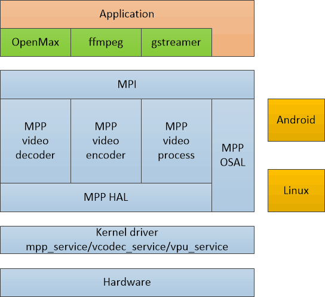
<center>图表 1 MPP系统框架</center>

-   硬件层Hardware

硬件层是瑞芯微系列芯片平台的视频编解码硬件加速模块，包括vdpu、vepu、rkvdec和rkvenc等不同类型、不同功能的硬件加速器。

-   内核驱动层Kernel driver

Linux内核的编码器硬件设备驱动，以及相关的mmu，内存，时钟，电源管理模块等。支持的平台版本主要是Linux kernel 3.10、4.4、4.19和5.10。MPP库对于内核驱动有依赖。

-   MPP层

用户态的MPP层屏蔽了不同操作系统和不同芯片平台的差异，为上层使用者提供统一的MPI接口。

MPP层包括MPI模块、OSAL模块、HAL模块以及视频编解码器（Video Decoder / Video Encoder）和视频处理功能模块（Video Process）。

-   操作系统层

MPP用户态的运行平台，如Android以及Debian等Linux发行版

-   应用层

MPP层通过MPI对接各种中间件软件，如OpenMax、ffmpeg和gstreamer，或者直接对接客户的上层应用。

## 1.3 平台支持

### 1.3.1 软件平台支持

MPP支持在各种版本的Android平台和纯Linux平台上运行。

支持瑞芯微Linux内核3.10、4.4、4.19和5.10版本，需要有vcodec_service设备驱动支持以及相应的DTS配置支持。

### 1.3.2 硬件平台支持

支持瑞芯微主流的各种系列芯片平台：

RK3288系列，RK3368系列，RK3399系列，RK3588系列

RK30xx系列，RK312x系列芯片，RK322x系列芯片，RK332x系列

RV1109 / RV1126系列（注：RV1107/RV1108会逐步退出支持）

## 1.4 功能支持

MPP支持的编解码功能随运行的芯片平台规格不同区别很大，请查询对应芯片的《Multimedia Benchmark》。

## 1.5 注意事项

如果想快速了解MPP的使用和demo，请直接转至——第四章 MPP demo说明。

如果想快速编译和使用MPP代码，请直接转至——第五章 MPP库编译与使用。

如果想了解MPP设计细节与设计思路，请参考MPP代码根目录的readme.txt，doc目录下的txt文档以及头文件的注释说明。

# 第二章 接口设计说明

本章节描述了用户在使用MPP过程中会直接接触到的数据结构，以及这些数据结构的使用说明。

由于视频编解码与视频处理过程需要处理大量的数据交互，包括码流数据、图像数据以及内存数据，同时还要处理与上层应用以及内核驱动的交叉关系，所以MPP设计了MPI接口，用于与上层交互。

本章节说明了MPI接口使用的数据结构，以及设计思路。

## 2.1 接口结构概述

下图为MPI接口使用的主要数据结构：


<center>图表 2 MPI接口使用的数据结构</center>

MppMem为C库malloc内存的封装。

MppBuffer为硬件用的dmabuf内存的封装。

MppPacket为一维缓存封装，可以从MppMem和MppBuffer生成，主要用于表示码流数据。

MppFrame为二维帧数据封装，可以从MppMem和MppBuffer生成，主要用于表示图像数据。

使用MppPacket和MppFrame就可以简单有效的完成一般的视频编解码工作。

以视频解码为例，码流输入端把地址和大小赋值给MppPacket，通过put_packet接口输入，在输出端通过get_frame接口得到输入图像MppFrame，即可完成最简单的视频解码过程。


<center>图表 3 使用简单接口实现视频解码</center>

MppMeta和MppTask为输入输出用任务的高级组合接口，可以支持指定输入输出方式等复杂使用方式，支持异步数据流处理。

**注意**：以上这些接口数据结构都是使用void\*句柄来引用使用，其目的是为了方便扩展和前向兼容。

本段落中的提到的成员都是通过形如mpp_xxx_set/get_xxx的接口来访问。

## 2.2 内存封装MppBuffer

MppBuffer主要用于描述供硬件使用的内存块（即缓存），提供了内存块的分配、释放和加减引用等功能，目前支持的分配器有：ion、drm和dma_heap。MppBuffer几个重要的参数成员如下：

| 成员名称 | 成员类型 | 描述说明                         |
|----------|----------|----------------------------------|
| ptr      | void \*  | 表示内存块的起始虚拟地址。       |
| size     | size_t   | 表示内存块的大小。               |
| fd       | int      | 表示内存块的用户态空间文件句柄。 |

在解码过程中，解码图像的缓存通常需要在固定的缓存池里进行轮转，为了实现这一点，MPP在MppBuffer基础之上又定义了MppBufferGroup。MppBuffer的使用方式有两种：常规使用方式和外部导入方式，由于二者的内存分配方式不同，也称为internal模式和external模式。

在MppBuffer常规使用方式下，MppBufferGroup由MPP内部生成和维护。通过mpp_buffer_get和mpp_buffer_put对内存块进行申请和释放，如下图所示：

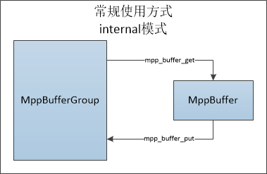
<center>图表 4 MppBuffer的常规使用方式</center>

其流程伪代码如下图：


这种方式可以实现解码器在解码过程中**零拷贝输出**（解码器的输出帧与解码器内部使用的参考帧用是同一帧），但不容易实现**零拷贝显示**（解码器的输出帧不一定在显示端可以直接显示），同时要求用户知道需要给解码器开多大的空间进行解码。

另一种使用方式是把MppBufferGroup完全做为一个缓存的管理器，用于管理外部导入的缓存。其使用方式如下图：

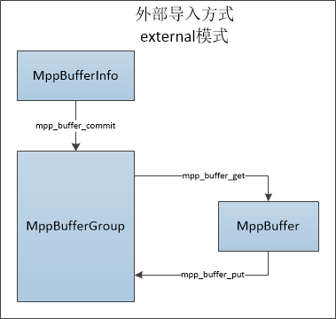
<center>图表 5 MppBuffer外部导入使用方式</center>

其流程伪代码如下图：

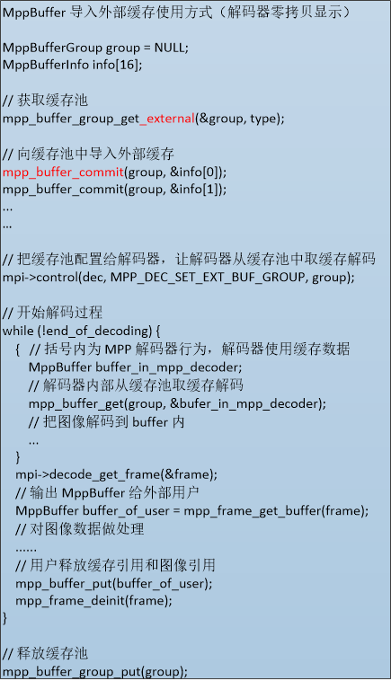

这种方式可以使得解码器使用外部的缓存，可以对接OpenMax/ffmpeg/gstreamer这样的中间件，也方便对接用户己有的上层代码，便于实现零拷贝显示。

## 2.3 码流封装MppPacket

MppPacket主要用于描述一维码流的相关信息，特别是有效数据的位置与长度。MppPacket几个重要的参数成员如下：

| 成员名称 | 成员类型 | 描述说明                                                                                           |
|----------|----------|----------------------------------------------------------------------------------------------------|
| data     | void \*  | 表示缓存空间的起始地址。                                                                           |
| size     | size_t   | 表示缓存空间的大小。                                                                               |
| pos      | void \*  | 表示缓存空间内有效数据的起始地址。                                                                 |
| length   | size_t   | 表示缓存空间内有效数据的长度。如果在decode_put_packet调用之后length变为0，说明此包码流己消耗完成。 |

其关系如下图所示：

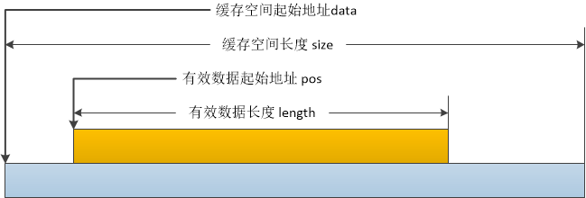

<center>图表 6 MppPacket重要参数说明</center>

MppPacket的其他配置参数成员如下：

| 成员名称 | 成员类型  | 描述说明                                                     |
| -------- | --------- | ------------------------------------------------------------ |
| pts      | RK_U64    | 表示显示时间戳（Present Time Stamp）。                       |
| dts      | RK_U64    | 表示解码时间戳（Decoding Time Stamp）。                      |
| eos      | RK_U32    | 表示码流结束标志（End Of Stream）。                          |
| buffer   | MppBuffer | 表示MppPacket对应的MppBuffer。                               |
| flag     | RK_U32    | 表示MPP内部使用的标志位，包含如下标志： <br/>\#define MPP_PACKET_FLAG_EOS (0x00000001) <br/>\#define MPP_PACKET_FLAG_EXTRA_DATA (0x00000002) <br/>\#define MPP_PACKET_FLAG_INTERNAL (0x00000004) <br/>\#define MPP_PACKET_FLAG_INTRA (0x00000008) |

MppPacket做为描述一维内存的结构体，在使用时需要使用malloc出来的内存或者使用MppBuffer的内存进行初始化。在释放MppPacket时有几种情况：

如果是外部malloc地址配置到MppPacket，不会做free释放处理，如下示例；

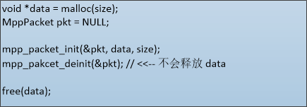

如果是拷贝产生的MppPacket，会做free释放内存，如下示例；

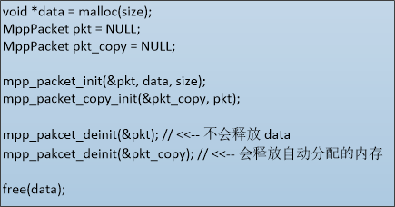

如果是MppBuffer产生的MppPacket，会在生成时对MppBuffer加引用，在释放时对MppPacket减引用。


## 2.4 图像封装MppFrame

MppFrame主要用于定义二维图像缓存的相关信息，有效数据的位置与长度。MppFrame几个重要的参数成员如下：

| 成员名称   | 成员类型 | 描述说明                                       |
|------------|----------|------------------------------------------------|
| width      | RK_U32   | 表示水平方向像素数，单位为像素个数。           |
| height     | RK_U32   | 表示垂直方向像素数，单位为像素个数。           |
| hor_stride | RK_U32   | 表示垂直方向相邻两行之间的距离，单位为byte数。 |
| ver_stride | RK_U32   | 表示图像分量之间的以行数间隔数，单位为1。      |

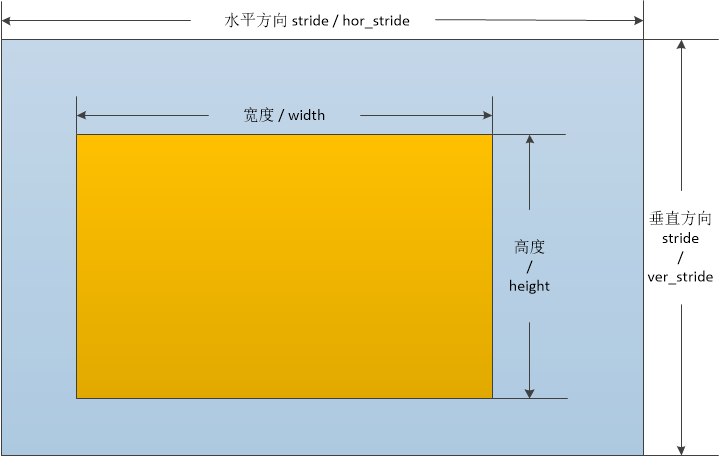
<center>图表 7 MppFrame重要参数说明</center>

MppFrame的其他配置参数成员如下：

| 成员名称    | 成员类型           | 描述说明                                                                                                                                                                                                                                      |
|-------------|--------------------|-----------------------------------------------------------------------------------------------------------------------------------------------------------------------------------------------------------------------------------------------|
| mode        | RK_U32             | 表示图像数据帧场属性： 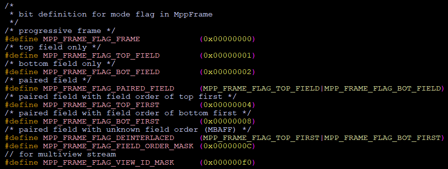                                                                                                                                                                        |
| pts         | RK_U64             | 表示图像的显示时间戳（Present Time Stamp）。                                                                                                                                                                                                  |
| dts         | RK_U64             | 表示图像的解码时间戳（Decoding Time Stamp）。                                                                                                                                                                                                 |
| eos         | RK_U32             | 表示图像的结束标志（End Of Stream）。                                                                                                                                                                                                         |
| errinfo     | RK_U32             | 表示图像的错误标志，是否图像内有解码错误。                                                                                                                                                                                                    |
| discard     | RK_U32             | 表示图像的丢弃标志，如果图像解码时的参考关系不满足要求，则这帧图像会被标记为需要丢弃，不被显示。                                                                                                                                              |
| buf_size    | size_t             | 表示图像需要分配的缓存大小，与图像的格式相关，也与解码数据的格式相关。                                                                                                                                                                        |
| info_change | RK_U32             | 如果为真，表示当前MppFrame是一个用于标记码流信息变化的描述结构，说明了新的宽高，stride，以及图像格式。 可能的info_change原因有： 图像序列宽高变化。 图像序列格式变化，如8bit变为10bit。 一旦info_change产生，需要重新分析解码器使用的内存池。 |
| fmt         | MppFrameFormat     | 表示图像色彩空间格式以及内存排布方式：                                                                                                                                                         |
| color_range | MppFrameColorRange | 表示图像数据彩色空间范围： YUV full range：0 \~ 255（8bit） YUV limit range：16 \~ 235（8bit）                                                                                                 |
| buffer      | MppBuffer          | 表示MppFrame对应的MppBuffer。                                                                                                                                                                                                                 |

对于解码器来说，MppFrame是其输出的信息结构体，码流解码后的信息（包括像素数据与pts，错误信息等相关信息）都需要带在MppFrame结构体给调用者。MppFrame中的pts/dts，以及eos标志，就是继承自对应的输入MppPacket。

同时，一旦发现码流分辨率改变，MppFrame中的info_change标志就会对应置位，向用户通知发生了info_change事件，需要用户进行缓存池修改处理。

## 2.5 高级任务封装MppTask

当MppPacket与MppFrame组成的接口无法满足需求时，需要使用MppTask做为一个数据容器，来满足复杂的输入输出需求。MppTask需要与poll/dequeuer/enqueue接口来配合使用，对比put_packet/get_frame等简单流程接口，MppTask的使用流程复杂，效率低，是为了满足复杂需求的代价。


<center>图表 8 使用MppTask来进行输入输出</center>

MppTask是一个通过关键字key值（MppMetaKey）来进行扩展的结构，可以通过扩展支持的数据类型来支持复杂的高级需求。可以使用通过mpp_task_meta_set/get_xxx系列接口来对MppTask里的不同关键字数据进行访问。


<center>图表 9 MppTask支持的数据类型与关键字类型</center>

在实际使用中，需要从MPP的输入端口通过dequeue接口获取MppTask，把需要处理的数据通过mpp_task_meta_set_xxx系列接口配置到MppTask里，之后enqueue输出到MPP实例进行处理。MPP的输出端口流程类似，需要把mpp_task_meta_set_xxx系列接口换成mpp_task_meta_get_xxx系列接口来从MppTask里获取数据。

目前实用的编码器接口，以及MJPEG解码接口有使用MppTask进行实现。

## 2.6 实例上下文封装MppCtx

MppCtx是提供给用户使用的MPP实例上下文句柄，用于指代解码器或编码器实例。

用户可以通过mpp_create接口获取MppCtx实例以及MppApi结构体，再通过mpp_init来初始化MppCtx的编解码类型与格式，之后通过decode_xxx/encode_xxx以及poll/dequeuer/enqueue接口来进行访问，使用结束时通过mpp_destroy接口进行销毁。


<center>图表 10 MppCtx使用过程</center>

## 2.7 API封装MppApi（MPI）

MppApi结构体封装了MPP的对外API接口，用户通过使用MppApi结构中提供的函数指针实现视频编解码功能，其结构如下：

| 成员名称          | 成员类型 | 描述                                                         |
| ----------------- | -------- | ------------------------------------------------------------ |
| size              | RK_U32   | MppApi结构体大小。                                           |
| version           | RK_U32   | MppApi结构体版本。                                           |
| decode            | 函数指针 | MPP_RET (\*decode)(MppCtx ctx, MppPacket packet, MppFrame \*frame) <br/>视频解码接口，同时进行输入与输出，单独使用。<br>ctx ：MPP实例上下文。 <br/>packet ：输入码流。<br/>frame ：输出图像。 <br/>返回值 ：0为正常，非零为错误码。 |
| decode_put_packet | 函数指针 | MPP_RET (\*decode_put_packet)(MppCtx ctx, MppPacket packet) <br/>视频解码输入接口，与decode_get_frame配合使用。 <br/>ctx ：MPP实例上下文。 <br/>packet ：输入码流。 <br/>返回值 ：0为正常，表示码流己被MPP处理；非零为出现错误，码流未被处理，需要把码流重新输入。 |
| decode_get_frame  | 函数指针 | MPP_RET (\*decode_get_frame)(MppCtx ctx, MppFrame \*frame) <br/>视频解码输出接口，与decode_put_packet配合使用。 <br/>ctx ：MPP实例上下文。 <br/>frame ：输出图像。 <br/>返回值 ：0为正常，表示获取输出过程正常，需要判断是否有得到有值的frame指针；非零为出现错误。 |
| encode            | 函数指针 | MPP_RET (\*encode)(MppCtx ctx, MppFrame frame, MppPacket \*packet) <br/>视频编码接口，同时进行输入与输出，单独使用。 <br/>ctx ：MPP实例上下文。 <br/>frame ：输入图像。 <br/>packet ：输出码流。 <br/>返回值 ：0为正常，非零为错误码。 |
| encode_put_frame  | 函数指针 | MPP_RET (\*encode_put_frame)(MppCtx ctx, MppFrame frame) <br/>视频编码输入接口，与encode_get_packet配合使用。 <br/>ctx ：MPP实例上下文。 <br/>frame ：输入图像。 <br/>返回值 ：0为正常，非零为错误码。 |
| encode_get_packet | 函数指针 | MPP_RET (\*encode_get_packet)(MppCtx ctx, MppPacket \*packet) <br/>视频编码输出接口，与encode_put_frame配合使用。 <br/>ctx ：MPP实例上下文。 <br/>packet ：输出码流。 <br/>返回值 ：0为正常，非零为错误码。 |
| poll              | 函数指针 | MPP_RET (\*poll)(MppCtx ctx, MppPortType type, MppPollType timeout) <br/>端口查询接口，用于查询端口是否有数据可供dequeue。 <br/>ctx ：MPP实例上下文。 <br/>type ：端口类型，分为输入端口与输出端口。 <br/>timeout ：查询超时参数，-1为阻塞查询，0为非阻塞查询，正值为超时毫秒数。 <br/>返回值 ：0为正常，有数据可取出，非零为错误码。 |
| dequeue           | 函数指针 | MPP_RET (\*dequeue)(MppCtx ctx, MppPortType type, MppTask \*task) <br/>端口出队列接口，用于从端口中取出MppTask结构。 <br/>ctx ：MPP实例上下文。 <br/>type ：端口类型，分为输入端口与输出端口。 <br/>task ：MppTask。 <br/>返回值 ：0为正常，有数据可取出，非零为错误码。 |
| enqueue           | 函数指针 | MPP_RET (\*enqueue)(MppCtx ctx, MppPortType type, MppTask task) <br/>端口入队列接口，用于往端口送入MppTask结构。 <br/>ctx ：MPP实例上下文。 <br/>type ：端口类型，分为输入端口与输出端口。 <br/>task ：MppTask。 <br/>返回值 ：0为正常，有数据可取出，非零为错误码。 |
| reset             | 函数指针 | MPP_RET (\*reset)(MppCtx ctx) <br/>复位接口，用于对MppCtx的内部状态进行复位，回到可用的初始化状态。需要注意的是，reset接口是阻塞的同步接口。 <br/>ctx ：MPP实例上下文。 <br/>返回值 ：0为正常，有数据可取出，非零为错误码。 |
| control           | 函数指针 | MPP_RET (\*control)(MppCtx ctx, MpiCmd cmd, MppParam param) <br/>控制接口，用于向MPP实例进行额外控制操作的接口。 <br/>ctx ：MPP实例上下文。 <br/>cmd ：Mpi命令类型，表示控制命令的不同类型的。 <br/>task ：Mpi命令参数，表示控制控制命令的附加参数。 <br/>返回值 ：0为正常，有数据可取出，非零为错误码。 |

# 第三章 MPI接口使用说明

本章节描述了用户使用MPI接口的具体过程，以及过程是的一些注意事项。

MPI（Media Process Interface）是MPP提供给用户的接口，用于提供硬件编解码功能，以及一些必要的相关功能。MPI是通过C结构里的函数指针方式提供给用户，用户可以通过MPP上下文结构MppCtx与MPI接口结构MppApi组合使用来实现解码器与编码器的功能。

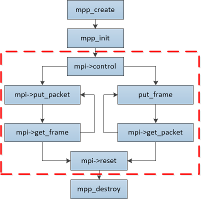
<center>图表 11 MPI接口范围</center>

如上图所示，mpp_create，mpp_init，mpp_destroy是操作MppCtx接口的过程，其中mpp_create接口也获取到了MPI接口结构体MppApi，真正的编码与解码过程是通过调用MppApi结构体里内的函数指针来实现，也就是上图中红框内的部分。红框内的函数调用分为编解码流程接口put/get_packet/frame和相关的control和reset接口。下文先描述编解码器接口，再对编解码器工作中的一些要点进行说明。

## 3.1 解码器数据流接口

解码器接口为用户提供了输入码流，输出图像的功能，接口函数为MppApi结构体里的decode_put_packet函数，decode_get_frame函数和decode函数。这组函数提供了最简洁的解码功能支持。

### 3.1.1 decode_put_packet

| 接口定义 | MPP_RET decode_put_packet(MppCtx ctx, MppPacket packet) |
|----------|---------------------------------------------------------|
| 输入参数 | ctx ：MPP解码器实例 packet ：待输入的码流数据           |
| 返回参数 | 运行错误码                                              |
| 功能     | 输入packet码流包数据给ctx指定的MPP解码器实例            |

#### 输入码流的形式

MPP的输入都是没有封装信息的裸码流，裸码流输入有两种形式：

1. 外部分帧

一种是外部已经按帧分段的数据，即每一包输入给decode_put_packet函数的MppPacket数据都已经包含完整的一帧，不多也不少。在这种情况下，MPP可以直接按包处理码流，是MPP的默认运行情况。

2. 内部分帧

另一种是按长度读取的数据，这样的数据无法判断一包MppPacket数据是否是完整的一帧，需要MPP内部进行分帧处理。MPP也可以支持这种形式的输入，但需要在mpp_init之前，通过control接口的MPP_DEC_SET_PARSER_SPLIT_MODE命令，MPP内的need_split标志打开。


这样，调用decode_put_packet输入的MppPacket就会被MPP重新分帧，进入到情况一的处理。

如果这两种情况出现了混用，会出现码流解码出错的问题。

分帧方式处理效率高，但需要输入码流之前先进行解析与分帧；

不分帧方式使用简单，但效率会受影响。

在mpi_dec_test的测试用例中，使用的是方式内部分帧的方式。在瑞芯微的Android SDK中，使用的是外部分帧的方式。用户可以根据自己的应用场景和平台条件进行选择。

#### 输入码流的消耗

输入MppPacket的有效数据长度为length，在送入decode_put_packet之后，如果输入码流被成功地消耗，函数返回值为零（MPP_OK），同时MppPacket的length被清为0。如果输入码流还没有被处理，会返回非零错误码，MppPacket的length保持不变。

#### 函数的工作模式

decode_put_packet函数的功能是输入待解码码流给MPP实例，但在一些情况下，MPP实例无法接收更多的数据，这时，工作于非阻塞模式的decode_put_packet会报出错误信息并直接返回。用户得到decode_put_packet返回的错误码之后，需要进行一定时间的等待，再重新送入码流数据，避免额外的频繁cpu开销。

#### 最大缓冲数据包数量

MPP实例默认可以接收4个输入码流包在处理队列中，如果码流送得太快，就会报出错误码要求用户等待后再送。

### 3.1.2 decode_get_frame

| 接口定义 | MPP_RET decode_get_frame(MppCtx ctx, MppFrame \*frame)     |
|----------|------------------------------------------------------------|
| 输入参数 | ctx ：MPP解码器实例。 frame ：用于获取MppFrame实例的指针。 |
| 返回参数 | 运行错误码                                                 |
| 功能     | 从ctx指定的MPP解码器实例里获取完成解码的frame描述信息。    |

MPP解码输出的图像是通过MppFrame结构来描述的，同时MppFrame结构也是MPP实例输出信息的管道，图像的错误信息，以及变宽高信息（info change）也是带在MppFrame结构进行输出的。

- 输出图像的错误信息

图像的错误信息为errinfo，表示图像内容是否有错误，errinfo不为零则表示码流解码时发生了错误，图像内容是有问题的，可以做丢弃处理。

- 解码器图像空间需求的确认

解码器在解码时，需要为输出图像获取保存像素数据的内存空间，用户需要给解码器提供足够大小，这个空间大小的需求，会在MPP解码器内部根据不同的芯片平台以及不同的视频格式需求进行计算，计算后的内存空间需求会通过MppFrame的成员变量buf_size提供给用户。用户需要按buf_size的大小进行内存分配，即可满足解码器的要求。

- 输出图像的变宽高信息（Info change）

当码流的宽高，格式，像素位深等信息发生变化时，需要反馈给用户，用户需要更新解码器使用的内存池，把新的内存更新给解码器。这里涉及到解码内存分配与使用模式，会在3.3.2 图像内存分配以及交互模式进行说明。

### 3.1.3 decode

decode函数是decode_put_packet与decode_get_frame数据的结合，为用户提供了两个函数的复合调用。其内部逻辑为：

1.  获取输出图像；
2.  如果输出图像获取成功即返回；
3.  判断码流己送入成功则返回；
4.  送入输入码流；
5.  标记码流送入是否成功并循环第一步；

在用户看来，decode函数首先是获取解码图像，有解码图像优先返回解码图像，没有可输出的解码图像的情况下送入码流，最后再尝试一次获取解码图像并退出。

## 3.2 解码器控制接口

### 3.2.1 control

在定义于rk_mpi_cmd.h文件的MpiCmd枚举类型定义了control接口命令字，其中与解码器和解码过程相关的命令如下：


从MPP_DEC_CMD_BASE到MPP_DEC_CMD_END之间的命令为解码器的control接口命令，分别介绍这些命令的功能如下：

- MPP_DEC_SET_FRAME_INFO

命令参数为MppFrame，用于配置解码器的默认宽高信息，返回的MppFrame结构会从解码器中带出需要分配的图像缓存大小。命令调用时机一般在mpp_init之后，mpi-\>decode_put_packet之前。

- MPP_DEC_SET_EXT_BUF_GROUP

命令参数为MppBufferGroup，用于把解码器图像解码所需的MppBufferGroup配置给解码器。命令调用时机视图像内存分配模式有不同。

- MPP_DEC_SET_INFO_CHANGE_READY

无命令参数，用于标记解码器使用的MppBufferGroup已经完成Info Change操作的reset处理，可以继续解码。命令调用时机视图像内存分配模式有不同。

- MPP_DEC_SET_PRESENT_TIME_ORDER

命令参数为RK_U32\*，用于处理异常的码流时间戳。

- MPP_DEC_SET_PARSER_SPLIT_MODE

命令参数为RK_U32\*，用于使能MPP内的协议解析器使用内部分帧处理，默认为码流按帧输入，不开启。命令调用时机是在- MPP_init之前。

- MPP_DEC_SET_PARSER_FAST_MODE

命令参数为RK_U32\*，用于使能MPP内的快速帧解析，提升解码的软硬件并行度，但副作用是会对错误码流的标志有影响，默认关闭。命令调用时机是在- MPP_init之前。

- MPP_DEC_GET_STREAM_COUT

命令参数为RK_U32\*，用于外部应用获取还未处理的码流包数量，历史遗留接口。

- MPP_DEC_GET_VPUMEM_USED_COUT

命令参数为RK_U32\*，用于外部应用获取MPP使用的MppBuffer数量，历史遗留接口。

- MPP_DEC_SET_VC1_EXTRA_DATA

暂未实现，历史遗留接口。

- MPP_DEC_SET_OUTPUT_FORMAT

命令参数为MppFrameFormat，用于外部应用配置JPEG解码器的输出格式，默认不使用。

- MPP_DEC_SET_DISABLE_ERROR

命令参数为RK_U32\*，用于关闭MPP解码器的错误处理。一旦使能，MPP解码会无视码流的错误情况，输出全部的可解码图像，同时不对输出的MppFrame结构里的errinfo进行标记。命令调用时机在decode_put_packet之前。

- MPP_DEC_SET_IMMEDIATE_OUT

命令参数为RK_U32\*，用于使能H.264解码器的立即输出模式。一旦使能，H.264解码器会忽略丢帧导致的帧序不连续情况，立即输出解码的图像。命令调用时机在decode_put_packet之前。

### 3.2.2 reset

reset接口用于把解码器恢复为正常初始化后的状态。

当用户发送最后一包MppPacket码流，并置上EOS标记送入解码器，解码器在处理完这最后一包数据之后会进入EOS的状态，不再接收和处理码流，需要reset之后再才能再继续接收新的码流。

## 3.3 解码器使用要点

解码器在使用过程中，需要注意的一些重要事项：

### 3.3.1 解码器单/多线程使用方式

MPP解码器的MPI接口是线程安全的，可以在多线环境下使用。单线程工作模式如mpi_dec_test的demo所示，多线程工作模式如mpi_dec_mt_test的demo所示。

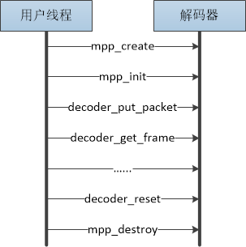

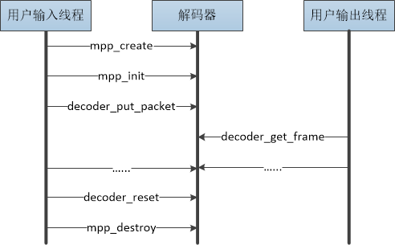

<center>图表 12 解码器单线程与多线程使用方式</center>

### 3.3.2 图像内存分配以及交互模式

解码器在解码图像时，需要获取内存空间以写入数据，在解码完成之后，这块内存空间需要交给用户使用，在用户使用完成之后要释放给解码器，在关闭解码器时要释放全部内存空间。在这种工作方式下，解码器与用户之间才可以形成零拷贝的数据交互。MPP解码器支持三种内存分配以及与用户交互图像数据的模式：

#### 模式一：纯内部分配模式

图像内存直接从MPP解码器内部分配，内存由解码器直接分配，用户得到解码器输出图像，在使用完成之后直接释放。


<center>图表 13 解码器图像内存纯内部分配模式示意图</center>

在这种方式下，用户不需要调用解码器control接口的MPP_DEC_SET_EXT_BUF_GROUP命令，只需要在解码器上报info change时直接调用control接口的MPP_DEC_SET_INFO_CHANGE_READY命令即可。解码器会自动在内部进行内存分配，用户需要把获取到的每帧数据直接释放。


<center>图表 14 解码器图像内存纯内部分配模式代码流程</center>

**优点：**

过程简单，可以快速完成一个可用的demo，评估解码器的性能。

**缺点：**

1.  内存都是从解码器内部分配的，如果内存在解码器被销毁时还没有被释放，有可能出现内存泄漏或崩溃问题。
2.  无法控制解码器的内存使用量。解码器可以不受限制地使用内存，如果码流输入的速度很快，用户又没有及时释放内存，解码器会很快消耗掉全部的可用内存。
3.  实现零拷贝的显示比较困难，因为内存是从解码器内部分配的，不一定和用户的显示系统兼容。

#### 模式二：半内部分配模式

这种模式是mpi_dec_test demo使用的默认模式。用户需要根据get_frame返回的MppFrame的buf_size来创建MppBufferGroup，并通过control接口的MPP_DEC_SET_EXT_BUF_GROUP配置给解码器。用户可以通过mpp_buffer_group_limit_config接口来限制解码器的内存使用量。

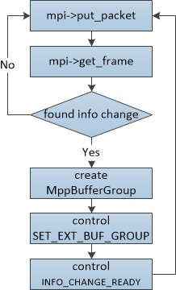
<center>图表 15 解码器图像内存半内部分配模式代码流程</center>

**优点：**

过程简单，易上手，可以一定程度限制内存的使用。

**缺点：**

1.  内存空间的限制并不准确，内存的使用量不是100%固定的，会有波动。
2.  同样难于实现零拷贝的显示。

#### 模式三：纯外部分配模式

这种模式通过创建空的external模式的MppBufferGroup，从用户那里导入外部分配器分析的内存块文件句柄（一般是dmabuf/ion/drm）。在Android平台上，Mediaserver通过gralloc从SurfaceFlinger获取显示用内存，把gralloc得到的文件句柄提交（commit）到MppBufferGroup里，再把MppBufferGroup通过control接口MPP_DEC_SET_EXT_BUF_GROUP命令配置给解码器，然后MPP解码器将循环使用gralloc得到的内存空间。


<center>图表 16 解码器图像内存纯外部分配模式示意图</center>


<center>图表 17 解码器图像内存纯外部分配模式代码流程</center>

**优点：**

直接使用外部显示用的内存，容易实现零拷贝。

**缺点：**

1.  理解与使用较困难。
2.  需要修改用户程序，一些用户程序的调用方式限制了纯外部分配方式的使用。

**纯外部分配模式使用时的注意事项：**

1.  如果图像内存分配是在解码器创建之前，需要有额外的方式来得到图像内存的大小。

一般的YUV420图像内存空间计算方法：

图像像素数据：hor_stride \* ver_stride \* 3 / 2
额外附加信息：hor_stride \* ver_stride / 2

2. 内存块数需要考虑解码和显示的需求，如果内存块数分配得太少，可能会卡住解码器。

H.264/H.265这类参考帧较多的协议需要20+内存块能保证一定能解码。其它协议需要10+内存块能保证一定能解码。

3. 如果在码流解码过程中发生了info change，需要把已有的MppBufferGroup进行reset，再commit进新的图像缓存，同时外部的显示也需要相应调整。


## 3.4 编码器数据流接口

编码器接口为用户提供了输入图像，输出码流的功能，接口函数为MppApi结构体里的encode_put_frame函数， encode_get_packet函数和encode函数。这组函数提供了简洁的编码功能支持。

### 3.4.1 encode_put_frame

| 接口定义 | MPP_RET encode_put_frame(MppCtx ctx, MppFrame frame) |
|----------|------------------------------------------------------|
| 输入参数 | ctx ：MPP解码器实例 frame ：待输入的图像数据         |
| 返回参数 | 运行错误码                                           |
| 功能     | 输入frame图像数据给ctx指定的MPP编码器实例            |

#### 函数的工作模式

由于编码器的输入图像一般都比较大，如果进行拷贝，效率会大幅度下降，所以编码器的输入函数需要等待编码器硬件完成对输入图像内存的使用，才能把输入函数返回，把使用后的图像归还给调用者。基于以上的考虑，encode_put_frame是阻塞式函数，会把调用者阻塞住，直到输入图像使用完成，会一定程度上导致软硬件运行无法并行，效率下降。

#### 拷贝与零拷贝输入

编码器的输入不支持CPU分配的空间，如果需要支持编码CPU分配的地址，需要分配MppBuffer并把数据拷贝进去，这样做会很大程度影响效率。编码器更喜欢dmabuf/ion/drm内存形式的输入，这样可以实现零拷贝的编码，额外的系统开销最小。

### 3.4.2 encode_get_packet

| 接口定义 | MPP_RET encode_get_packet(MppCtx ctx, MppPacket \*packet)  |
|----------|------------------------------------------------------------|
| 输入参数 | ctx ：MPP解码器实例 packet ：用于获取MppPacket实例的指针。 |
| 返回参数 | 运行错误码                                                 |
| 功能     | 从ctx指定的MPP编码器实例里获取完成编码的packet描述信息。   |

#### 取头信息与图像数据

以H.264编码器为例，编码器的输出数据分为头信息（sps/pps）和图像数据（I/P slice）两部分，头信息需要通过control接口的MPP_ENC_GET_EXTRA_INFO命令获取，图像数据则是通过encode_get_packet接口来获取。获取的时机是在control接口的SET_RC_CFG/SET_PREP_CFG/SET_CODEC_CFG参数配置命令完成之后。在参数配置命令调用时，编码器会进行各个参数的更新，在更新全部完成之后，调用MPP_ENC_GET_EXTRA_INFO获取到的头信息才是最新的。

#### H.264编码器输出码流的格式

目前硬件固定输出带00 00 00 01起始码的码流，所以encode_get_packet函数获取到码流都是带有00 00 00 01起始码。如果需要去掉起始码，可以从起始码之后的地址进行拷贝。

#### 码流数据的零拷贝

由于使用encode_put_frame和encode_get_packet接口时没有提供配置输出缓存的方法，所以使用encode_get_packet时一定会进行一次拷贝。一般来说，编码器的输出码流相对于输入图像不算大，数据拷贝可以接受。如果需要使用零拷贝的接口，需要使用enqueue/dequeue接口以及MppTask结构。

### 3.4.3 encode

暂未实现

## 3.5 编码器控制接口

编码器与解码器不同，需要用户进行一定的参数配置。编码器需要用户通过control接口配置编码器信息之后才可以进行编码工作。

### 3.5.1 control与MppEncCfg

MPP推荐使用封装后的MppEncCfg结构通过control接口的MPP_ENC_SET_CFG/MPP_ENC_GET_CFG命令来进行编码器信息配置。

由于编码器可配置的选项与参数繁多，使用固定结构体容易出现接口结构体频繁变化，导致接口二进制兼容性无法得到保证，版本管理复杂，极大增加维护量。

为了缓解这个问题MppEncCfg使用(void \*)作为类型，使用<字符串-值>进行key map式的配置，函数接口分为s32/u32/s64/u64/ptr，对应的接口函数分为set与get两组，如下：

```c
配置编码器信息：
MPP_RET mpp_enc_cfg_set_s32(MppEncCfg cfg, const char *name, RK_S32 val);
MPP_RET mpp_enc_cfg_set_u32(MppEncCfg cfg, const char *name, RK_U32 val);
MPP_RET mpp_enc_cfg_set_s64(MppEncCfg cfg, const char *name, RK_S64 val);
MPP_RET mpp_enc_cfg_set_u64(MppEncCfg cfg, const char *name, RK_U64 val);
MPP_RET mpp_enc_cfg_set_ptr(MppEncCfg cfg, const char *name, void *val);
MPP_RET mpp_enc_cfg_set_st(MppEncCfg cfg, const char *name, void *val);
获取编码器信息：
MPP_RET mpp_enc_cfg_get_s32(MppEncCfg cfg, const char *name, RK_S32 *val);
MPP_RET mpp_enc_cfg_get_u32(MppEncCfg cfg, const char *name, RK_U32 *val);
MPP_RET mpp_enc_cfg_get_s64(MppEncCfg cfg, const char *name, RK_S64 *val);
MPP_RET mpp_enc_cfg_get_u64(MppEncCfg cfg, const char *name, RK_U64 *val);
MPP_RET mpp_enc_cfg_get_ptr(MppEncCfg cfg, const char *name, void **val);
MPP_RET mpp_enc_cfg_get_st(MppEncCfg cfg, const char *name, void *val);
```


字符串一般用\[类型:参数\]的方式进行定义，可支持的字符串与参数类型如下：

| 参数字串                | 接口 | 实际类型                            | 描述说明                                                     |
| ----------------------- | ---- | ----------------------------------- | ------------------------------------------------------------ |
| base:low_delay          | S32  | RK_S32                              | 表示低延时输出模式。 0 – 表示关闭；1 – 表示开启。            |
| rc:mode                 | S32  | MppEncRcMode                        | 表示码率控制模式，目前支持CBR、VBR和AVBR三种： CBR为Constant Bit Rate，固定码率模式。 在固定码率模式下，目标码率起决定性作用。 VBR为Variable Bit Rate，可变码率模式。 在可变码率模式下，最大最小码率起决定性作用。 AVBR为Adaptive Variable Bit Rate，自适应码率模式。 在自适应码率模式下，静止场景中最小码率起决定性作用，运动场景中最大码率起决定性作用。最终平均码率将接近目标码率。 FIX_QP为固定QP模式，用于调试和性能评估。 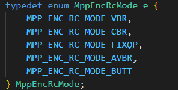 |
| rc:bps_target           | S32  | RK_S32                              | 表示CBR模式下的目标码率。                                    |
| rc:bps_max              | S32  | RK_S32                              | 表示VBR/AVBR模式下的最高码率。                               |
| rc:bps_min              | S32  | RK_S32                              | 表示VBR/AVBR模式下的最低码率。                               |
| rc:fps_in_flex          | S32  | RK_S32                              | 表示输入帧率是否可变的标志位，默认为0。 为0表示输入帧率固定，帧率计算方式为： fps_in_num / fps_in_denorm，可以表示分数帧率。 为1表示输入帧率可变。可变帧率的情况下，帧率不固定，对应的码率计算与分配的规则变为按实际时间进行计算。 |
| rc:fps_in_num           | S32  | RK_S32                              | 表示输入帧率分数值的分子部分，默认值为30。                   |
| rc:fps_in_denorm        | S32  | RK_S32                              | 表示输入帧率分数值的分母部分，默认值为1。                    |
| rc:fps_out_flex         | S32  | RK_S32                              | 表示输出帧率是否可变的标志位，默认为0。 为0表示输出帧率固定，帧率计算方式为： fps_out_num / fps_out_denorm，可以表示分数帧率。 为1表示输出帧率可变。可变帧率的情况下，帧率不固定，对应的码流输出时间按实际时间进行计算。 |
| rc:fps_out_num          | S32  | RK_S32                              | 表示输出帧率分数值的分子部分，默认值为30。                   |
| rc:fps_out_denorm       | S32  | RK_S32                              | 表示输出帧率分数值的分母部分，默认值为1。                    |
| rc:gop                  | S32  | RK_S32                              | 表示Group Of Picture，即两个I帧之间的间隔，含义如下： 0 – 表示只有一个I帧，其他帧均为P帧。 1 – 表示全为I帧。 2 – 表示序列为I P I P I P… 3 – 表示序列为I P P I P P I P P… 一般情况下，gop应配置为输出帧率的整数倍，默认值为两倍输出帧率。 |
| rc:max_reenc_times      | U32  | RK_U32                              | 表示一帧图像最大重编码次数，默认值为1。在低延时输出模式下，max_reenc_times只能配置为0。 |
| rc:priority             | U32  | MppEncRcPriority                    | 表示超大帧重编优先级。 0 – 表示目标码率优先。 1 – 表示超大帧阈值优先。 此优先级只在超大帧重编时有效。 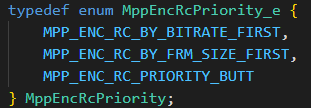 |
| rc:drop_mode            | U32  | MppEncRcDropFrmMode                 | 表示丢帧模式。 0 – 表示丢帧模式未使能。 1 – 表示正常丢帧模式。当瞬时码率超过丢帧阈值时，正常丢帧。 2 – 表示pskip构造模式。当瞬时码率超过丢帧阈值时，编码pskip帧替代当前帧。 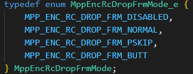 |
| rc:drop_thd             | U32  | RK_U32                              | 表示丢帧阈值控制变量，默认值为20。丢帧阈值计算公式为： bps_max \* (1 + drop_thd / 100)。 |
| rc:drop_gap             | U32  | RK_U32                              | 表示最大允许连续丢帧数。当输出码流的poc_type为2时，drop_gap只能配置为1。 |
| rc:max_i_prop           | S32  | RK_S32                              | 表示最大 IP 比例，用于钳位IP比例的范围，默认值为30。当max_i_proportion被调整较小时，会导致I帧模糊，P 帧清晰。 |
| rc:min_i_prop           | S32  | RK_S32                              | 表示最小 IP 比例，用于钳位IP比例的范围，默认值为10。当min_i_proportion被调整较大时，会导致I帧清晰，P 帧模糊。 |
| rc:init_ip_ratio        | S32  | RK_S32                              | 表示初始IP比例，默认值为160。IP比例表示I帧和P帧的bits数的比例，有效范围为\[160, 640\]。 |
| rc:super_mode           | U32  | MppEncRcSuperFrameMode              | 表示超大帧处理模式。 0 – 表示无特殊策略。 1 – 表示丢弃超大帧。 2 – 表示重编超大帧。<br>  |
| rc:super_i_thd          | U32  | RK_U32                              | 表示超大I帧阈值。                                            |
| rc:super_p_thd          | U32  | RK_U32                              | 表示超大P帧阈值。                                            |
| rc:debreath_en          | U32  | RK_U32                              | 表示去除呼吸效应使能标志。 0 – 表示关闭；1 – 表示开启。      |
| rc:debreath_strength    | U32  | RK_U32                              | 表示去除呼吸效应强度调节参数，有效范围为\[0, 35\]。值越大，呼吸效应改善会越弱；值越小，呼吸效应改善越明显。 |
| rc:qp_init              | S32  | RK_S32                              | 表示初始QP值。                                               |
| rc:qp_min               | S32  | RK_S32                              | 表示P、B帧的最小QP值。                                       |
| rc:qp_max               | S32  | RK_S32                              | 表示P、B帧的最大QP值。                                       |
| rc:qp_min_i             | S32  | RK_S32                              | 表示I帧的最小QP值。                                          |
| rc:qp_max_i             | S32  | RK_S32                              | 表示I帧的最大QP值。                                          |
| rc:qp_step              | S32  | RK_S32                              | 表示相临两帧之间的帧级QP变化幅度。目前仅配备于RV1109/RV1126系统芯片，默认值为4。 |
| rc:qp_ip                | S32  | RK_S32                              | 表示I帧和P帧的QP差值，有效范围为\[0, 8\]。                   |
| rc:qp_vi                | S32  | RK_S32                              | 表示虚拟I帧和P帧的QP差值，有效范围为\[0, 6\]。               |
| rc:hier_qp_en           | S32  | RK_S32                              | 表示QP分层使能标识。 0 – 表示关闭；1 – 表示开启。            |
| rc:hier_qp_delta        | St   | RK_S32 \*                           | 表示各层帧相对于第0层P帧的QP差值，层数为4，用数组存储。      |
| rc:hier_frame_num       | St   | RK_S32 \*                           | 表示各层帧数，层数为4，用数组存储。                          |
| rc:stats_time           | S32  | RK_S32                              | 表示瞬时码率统计时间，单位为秒，有效范围为\[1, 60\]。默认值为3。 |
| prep:width              | S32  | RK_S32                              | 表示图像水平方向像素数，单位为像素个数。                     |
| prep:height             | S32  | RK_S32                              | 表示图像垂直方向像素数，单位为像素个数。                     |
| prep:format             | S32  | MppFrameFormat                      | 表示图像色彩空间格式以及内存排布方式。 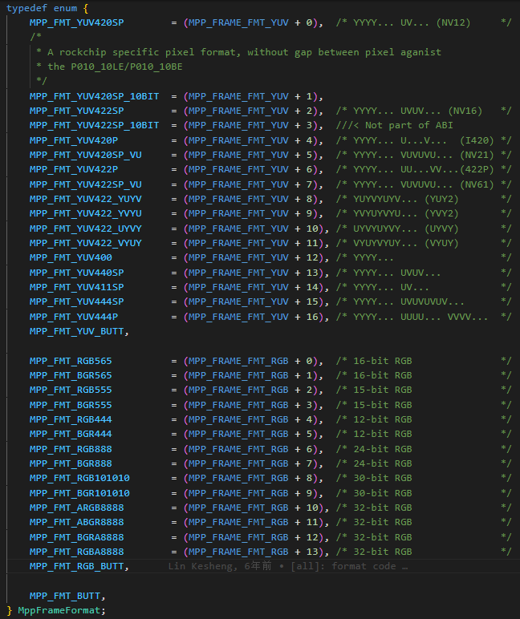 |
| prep:hor_stride         | S32  | RK_S32                              | 表示图像垂直方向相邻两行之间的距离，单位为byte数。           |
| prep:ver_stride         | S32  | RK_S32                              | 表示图像分量之间的以行数间隔数，单位为1。                    |
| prep:colorspace         | S32  | MppFrameColorSpace                  | 表示VUI信息中色域空间类型，用于colour_primaries和transfer_characteristics的备注。 |
| prep:colorprim          | S32  | MppFrameColorPrimaries              | 表示VUI信息中colour_primaries参数，具体含义请参考H.264/H.265协议。 |
| prep:colortrc           | S32  | MppFrameColorTransferCharacteristic | 表示VUI信息中transfer_characteristics参数，具体含义请参考H.264/H.265协议。 |
| prep:colorrange         | S32  | MppFrameColorRange                  | 表示YUV转RGB的色彩范围。 0 – 表示未指定，由MPP配置。 1 – 表示码流格式为MPEG，限制色彩范围。 2 – 表示码流格式为JPEG，不限制色彩范围。  |
| prep:range              | S32  | MppFrameColorRange                  | 同prep:colorrange，用于前向兼容MPP版本。                     |
| prep:rotation           | S32  | MppEncRotationCfg                   | 表示图像旋转属性，默认值为0。除了RK3588芯片，其他芯片均不支持FBC数据结构的旋转操作。 0 – 表示图像不旋转。 1 – 表示图像逆时针旋转90度。 2 – 表示图像逆时针旋转180度。 3 – 表示图像逆时针旋转270度。 |
| prep:mirroring          | S32  | RK_S32                              | 表示图像镜像属性，默认值为0。除了RK3588芯片，其他芯片均不支持FBC数据结构的镜像操作。 0 – 表示图像不做镜像。 1 – 表示图像做水平镜像。 2 – 表示图像做垂直镜像。 |
| codec:type              | S32  | MppCodingType                       | 表示MppEncCodecCfg对应的协议类型，需要与MppCtx初始化函数mpp_init的参数一致。  |
| h264:stream_type        | S32  | RK_S32                              | 表示H.264码流格式类型。 0 – 表示Annex-B格式，即用00 00 00 01的起始码对齐、分割码流数据。 1 – 表示AVCC格式，仅支持extradata中码流的解析。 目前MPP内部固定为带00 00 00 01起始码的格式。 |
| h264:profile            | S32  | RK_S32                              | 表示SPS中的profile_idc参数。 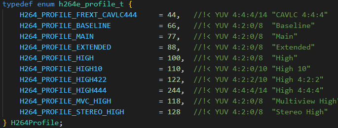      |
| h264:level              | S32  | RK_S32                              | 表示SPS中的level_idc参数，其中10表示level 1.0： 10/11/12/13 – qcif@15fps / cif@7.5fps / cif@15fps / cif@30fps 20/21/22 – cif@30fps / half-D1@25fps / D1@12.5fps 30/31/32 – D1@25fps / 720p@30fps / 720p@60fps 40/41/42 – 1080p@30fps / 1080p@30fps / 1080p@60fps 50/51/52 – 4K@30fps / 4K@30fps / 4K@60fps 一般配置为level 4.1即可满足要求。 |
| h264:poc_type           | U32  | RK_U32                              | 表示SPS中的pic_order_cnt_type参数。                          |
| h264:log2_max_poc_lsb   | U32  | RK_U32                              | 表示SPS中的log2_max_pic_order_cnt_lsb_minus4参数，只在pic_order_cnt_type为0时使用。 |
| h264:log2_max_frm_num   | U32  | RK_U32                              | 表示SPS中的log2_max_frame_num_minus4参数。                   |
| h264:gaps_not_allowed   | U32  | RK_U32                              | 表示SPS中的gaps_in_frame_num_value_allowed_flag参数的非。    |
| h264:cabac_en           | S32  | RK_S32                              | 表示编码器使用的熵编码格式。 0 – 表示CAVLC，自适应变长编码。 1 – 表示CABAC，自适应算术编码。 |
| h264:cabac_idc          | S32  | RK_S32                              | 表示H.264协议中的cabac_init_idc参数，只在cabac_en为1时使用，有效范围为\[0, 2\]。 |
| h264:trans8x8           | S32  | RK_S32                              | 表示H.264协议中transform_8x8_mode_flag参数，即8x8变换的使能标志。 0 – 表示关闭，在Baseline/Main profile时固定关闭。 1 – 表示开启，在High profile时可选开启。 |
| h264:const_intra        | S32  | RK_S32                              | 表示H.264协议中constrained_intra_pred_flag参数，即 constrained_intra_pred_mode模式使能标志。 0 – 表示关闭；1 – 表示开启。 |
| h264:scaling_list       | S32  | RK_S32                              | 表示H.264协议中scaling_list_matrix模式。 0 – 表示flat matrix；1 – 表示默认matrix。 |
| h264:cb_qp_offset       | S32  | RK_S32                              | 表示H.264协议中chroma_qp_index_offset参数，即应添加到QPY和QSY的偏移量，用于寻址Cb色度分量的QPC表，有效范围为\[-12, 12\]。 |
| h264:cr_qp_offset       | S32  | RK_S32                              | 表示H.264协议中second_chroma_qp_index_offset参数，即应添加到QPY和QSY的偏移量，用于寻址Cr色度分量的QPC表，有效范围为\[-12, 12\]。 |
| h264:dblk_disable       | S32  | RK_S32                              | 表示H.264协议中deblocking_filter_control_present_flag参数，即deblock禁用标志，有效范围为\[0, 2\]。 <br/>0 – deblocking开启。 <br/>1 – deblocking关闭。<br/>2 – 在slice边界关闭deblocking。 |
| h264:dblk_alpha         | S32  | RK_S32                              | 表示H.264协议中slice_alpha_c0_offset_div2参数，有效范围为\[-6, 6\]。 |
| h264:dblk_beta          | S32  | RK_S32                              | 表示H.264协议中slice_beta_offset_div2参数，有效范围为\[-6, 6\]。 |
| h264:qp_init            | S32  | RK_S32                              | 表示初始QP值，同rc:qp_init，用于前向兼容MPP版本。            |
| h264:qp_max             | S32  | RK_S32                              | 表示P、B帧的最大QP值，同rc:qp_max，用于前向兼容MPP版本。     |
| h264:qp_min             | S32  | RK_S32                              | 表示P、B帧的最小QP值，同rc:qp_min，用于前向兼容MPP版本。     |
| h264:qp_max_i           | S32  | RK_S32                              | 表示I帧的最大QP值，同rc:qp_max_i，用于前向兼容MPP版本。      |
| h264:qp_min_i           | S32  | RK_S32                              | 表示I帧的最小QP值，同rc:qp_min_i，用于前向兼容MPP版本。      |
| h264:qp_step            | S32  | RK_S32                              | 表示相临两帧之间的帧级QP变化幅度，同rc:qp_step，用于前向兼容MPP版本。 |
| h264:qp_delta_ip        | S32  | RK_S32                              | 表示I帧和P帧的QP差值，同rc:qp_ip，用于前向兼容MPP版本。      |
| h264:max_tid            | S32  | RK_S32                              | 表示最大时序层ID。                                           |
| h264:max_ltr            | S32  | RK_S32                              | 表示最大长期参考帧数。                                       |
| h264:prefix_mode        | S32  | RK_S32                              | 表示添加prefix nal的使能标志。 0 – 表示关闭。 1 – 表示开启，在SEI信息和硬件编码的码流数据之间添加prefix nal。 |
| h264:base_layer_pid     | S32  | RK_S32                              | 表示基准层优先级ID。                                         |
| h264:constraint_set     | U32  | RK_U32                              | 表示SPS中的constraint_set0_flag至constraint_set5_flag参数。  |
| h265:profile            | S32  | RK_S32                              | 表示VPS中的profile_idc参数。目前MPP内部固定为1，Main profile。 |
| h265:level              | S32  | RK_S32                              | 表示VPS中的level_idc参数。                                   |
| h265:scaling_list       | S32  | RK_S32                              | 表示H.265协议中scaling_list_matrix模式。 0 – 表示flat matrix，1 – 表示默认matrix。 |
| h265:cb_qp_offset       | S32  | RK_S32                              | 表示H.265协议中chroma_qp_index_offset参数，即应添加到QPY和QSY的偏移量，用于寻址Cb色度分量的QPC表，有效范围为\[-12, 12\]。 |
| h265:cr_qp_offset       | S32  | RK_S32                              | 表示H.265协议中second_chroma_qp_index_offset参数，即应添加到QPY和QSY的偏移量，用于寻址Cr色度分量的QPC表，有效范围为\[-12, 12\]。 |
| h265:dblk_disable       | S32  | RK_S32                              | 表示H.265协议中deblocking_filter_control_present_flag参数，即deblock禁用标志，有效范围为\[0, 2\]。 <br/>0 – deblocking开启。 <br/>1 – deblocking关闭。 <br/>2 – 在slice边界关闭deblocking。 |
| h265:dblk_alpha         | S32  | RK_S32                              | 表示H.265协议中slice_alpha_c0_offset_div2参数，有效范围为\[-6, 6\]。 |
| h265:dblk_beta          | S32  | RK_S32                              | 表示H.265协议中slice_beta_offset_div2参数，有效范围为\[-6, 6\]。 |
| h265:qp_init            | S32  | RK_S32                              | 表示初始QP值，同rc:qp_init，用于前向兼容MPP版本。            |
| h265:qp_max             | S32  | RK_S32                              | 表示P、B帧的最大QP值，同rc:qp_max，用于前向兼容MPP版本。     |
| h265:qp_min             | S32  | RK_S32                              | 表示P、B帧的最小QP值，同rc:qp_min，用于前向兼容MPP版本。     |
| h265:qp_max_i           | S32  | RK_S32                              | 表示I帧的最大QP值，同rc:qp_max_i，用于前向兼容MPP版本。      |
| h265:qp_min_i           | S32  | RK_S32                              | 表示I帧的最小QP值，同rc:qp_min_i，用于前向兼容MPP版本。      |
| h265:qp_step            | S32  | RK_S32                              | 表示相临两帧之间的帧级QP变化幅度，同rc:qp_step，用于前向兼容MPP版本。 |
| h265:qp_delta_ip        | S32  | RK_S32                              | 表示I帧和P帧的QP差值，同rc:qp_ip，用于前向兼容MPP版本。      |
| h265:sao_luma_disable   | S32  | RK_S32                              | 表示H.265协议中slice_sao_luma_flag参数的非，即当前slice亮度分量的采样点自适应偏移的禁用标志。 <br/>0 – 亮度分量的SAO开启。 <br/>1 – 亮度分量的SAO关闭。 |
| h265:sao_chroma_disable | S32  | RK_S32                              | 表示H.265协议中slice_sao_chroma_flag参数的非，即当前slice色度分量的采样点自适应偏移的禁用标志。 <br/>0 – 色度分量的SAO开启。 <br/>1 – 色度分量的SAO关闭。 |
| vp8:qp_init             | S32  | RK_S32                              | 表示初始QP值，同rc:qp_init，用于前向兼容MPP版本。            |
| vp8:qp_max              | S32  | RK_S32                              | 表示P、B帧的最大QP值，同rc:qp_max，用于前向兼容MPP版本。     |
| vp8:qp_min              | S32  | RK_S32                              | 表示P、B帧的最小QP值，同rc:qp_min，用于前向兼容MPP版本。     |
| vp8:qp_max_i            | S32  | RK_S32                              | 表示I帧的最大QP值，同rc:qp_max_i，用于前向兼容MPP版本。      |
| vp8:qp_min_i            | S32  | RK_S32                              | 表示I帧的最小QP值，同rc:qp_min_i，用于前向兼容MPP版本。      |
| vp8:qp_step             | S32  | RK_S32                              | 表示相临两帧之间的帧级QP变化幅度，同rc:qp_step，用于前向兼容MPP版本。 |
| vp8:qp_delta_ip         | S32  | RK_S32                              | 表示I帧和P帧的QP差值，同rc:qp_ip，用于前向兼容MPP版本。      |
| vp8:disable_ivf         | S32  | RK_S32                              | 表示ivf封装的禁用标志，禁用后硬件编码的码流数据不封装成ivf格式。 <br/>0 – 表示开启；<br/>1 – 表示关闭。 |
| jpeg:quant              | S32  | RK_S32                              | 表示JPEG编码器使用的量化参数等级，编码器一共内置了11级量化系数表格，从0到10，图像质量从差到好。 |
| jpeg:qtable_y           | Ptr  | RK_U8 \*                            | 表示样本亮度分量量化表，大小为64，用数组存储。               |
| jpeg:qtable_u           | Ptr  | RK_U8 \*                            | 表示样本色度分量u量化表，大小为64，用数组存储。              |
| jpeg:qtable_v           | Ptr  | RK_U8 \*                            | 表示样本色度分量v量化表，大小为64，用数组存储。              |
| jpeg:q_factor           | S32  | RK_S32                              | 表示量化表因子，有效范围为\[1, 99\]。qfactor 越大，量化表中的量化系数越小，得到的图像质量更好，但编码压缩率更低。同理，qfactor 越小，量化表中的量化系数越大，编码压缩率更高，但得到的图像质量更差。默认值为80。 |
| jpeg:qf_max             | S32  | RK_S32                              | 表示量化表因子最大值，默认值为99。                           |
| jpeg:qf_min             | S32  | RK_S32                              | 表示量化表因子最小值，默认值为1。                            |
| split:mode              | U32  | MppEncSplitMode                     | 表示H.264/H.265协议的slice切分模式  <br>0– 不切分。<br>1– BY_BYTE 切分 slice 根据 slice 大小。<br>2– BY_CTU 切分 slice 根据宏块或 CTU 个数。 |
| split:arg               | U32  | RK_U32                              | Slice切分参数： 在BY_BYTE模式下，参数表示每个slice的最大大小。 在BY_CTU模式下，参数表示每个slice包含的宏块或CTU个数。 |

其他的字符串与参数会进行后续扩展。

### 3.5.2 control其他命令

在定义于rk_mpi_cmd.h文件的MpiCmd枚举类型定义了control接口命令字，其中与编码器和编码过程相关的命令如下：


从MPP_ENC_CMD_BASE到MPP_ENC_CMD_END之间的命令为编码器的control接口命令，其中配置命令的MPP_ENC_SET/GET\_ CFG已经做为基本的配置命令在3.5.1进行了介绍。剩下的命令在下面进行简要的介绍，其中的命令与编码器硬件相关，只有部分硬件支持。

目前MPP支持的编码器硬件分为vepu系列和rkvenc系列，vepu系列支持H.264编码，vp8编码和jpeg编码，配备于绝大多数RK芯片中。rkvenc系列只支持H.264编码，目前只配备于RV1109/RV1126系统芯片，其支持的编码功能相对于vepu系统会更多更强。

部分CMD命令简要说明：

- ~~MPP_ENC_SET_PREP_CFG/ MPP_ENC_GET_PREP_CFG~~

- ~~MPP_ENC_SET_RC_CFG/ MPP_ENC_GET_RC_CFG~~

- ~~MPP_ENC_SET_CODEC_CFG/ MPP_ENC_GET_CODEC_CFG~~

废弃命令，为了前向兼容保留，不要使用

- MPP_ENC_SET_IDR_FRAME

无命令参数，用于向编码器请求I帖，编码器收到请求之后，会将待编码的下一帧编码为IDR帧。

全部硬件都支持。

- ~~MPP_ENC_SET_OSD_LEGACY_0~~

- ~~MPP_ENC_SET_OSD_LEGACY_1~~

- ~~MPP_ENC_SET_OSD_LEGACY_2~~

废弃命令，前向兼容用保留，不要使用

- MPP_ENC_GET_HDR_SYNC/ ~~MPP_ENC_GET_EXTRA_INFO~~

用于单独获取码流头数据的命令，其中MPP_ENC_GET_EXTRA_INFO为旧命令，不推荐使用。

MPP_ENC_GET_HDR_SYNC输入参数为MppPacket，需要外部用户分配好空间并封装为MppPacket再control到编码器，control接口调用返回时就完成了数据拷贝，线程安全。调用时机在编码器基本配置完成之后。需要用户手动释放之前分配的MppPacket。

MPP_ENC_GET_EXTRA_INFO输入参数为MppPacket\*，会获取编码器的内部MppPacket来进行访问。调用时机在编码器基本配置完成之后。需要注意的是，这里得到的MppPacket是MPP的内部空间，不需要用户释放。

由于在多线程情况下，MPP_ENC_GET_EXTRA_INFO命令获取的MppPacket有可能在读取时被其他control修改，所以这个命令并不是线程安全的，仅做为旧vpu_api的兼容用，不要再使用。

- ~~MPP_ENC_SET_SEI_CFG/MPP_ENC_GET_SEI_DATA~~

废弃命令，前向兼容用保留，不要使用

- ~~MPP_ENC_PRE_ALLOC_BUFF/ MPP_ENC_SET_QP_RANGE/ MPP_ENC_SET_ROI_CFG/ MPP_ENC_SET_CTU_QP~~

废弃命令，前向兼容用保留，不要使用

- MPP_ENC_GET_RC_API_ALL

获取MPP目前支持的码率控制策略API信息的接口，输入 RcApiQueryAll\*指针，在返回时填充好结构体内容

- MPP_ENC_GET_RC_API_BY_TYPE

获取指定MppCodingType类型的所有码率控制策略API信息，输入RcApiQueryType\*指针并指定MppCodingType，在返回时会填充好结构体内容。

- MPP_ENC_SET_RC_API_CFG

注册外部码率控制策略API，输入RcImplApi\*指针，该结构中的函数指针定义了码率控制策略插件的行为，注册之后的码率控制策略才可以被查询和激活使用。

- MPP_ENC_GET_RC_API_CURRENT

返回当前使用的码率控制策略API信息，输入RcApiBrief\*指针，在返回时会填充好结构体内容。

- MPP_ENC_SET_RC_API_CURRENT

激活指定名字的码率控制策略API，输入RcApiBrief\*指针，编码器会搜索到RcApiBrief中指定字符串名字的码率控制策略API并激活为当前码率控制策略。

- MPP_ENC_SET_HEADER_MODE/MPP_ENC_GET_HEADER_MODE

配置和获取H.264/H.265编码器的SEI调试信息输出方式，调试用开关，以后会被环境变量取代，不要使用。

- MPP_ENC_SET_SPLIT/MPP_ENC_GET_SPLIT

配置和获取H.264/H265编码器的slice切分配置信息，己被MppEncCfg中的split:mode和split:arg取代，不要使用

- MPP_ENC_SET_REF_CFG

配置编码器高级参考帧模式，默认不需要配置，在需要配置长期参考帧，短期参考帧参考关系模式时使用，用于配置特殊的参考关系模式。高级接口，文档待完善。

- MPP_ENC_SET_OSD_PLT_CFG

用于配置rkvenc系列硬件的OSD调色板，命令参数为MppEncOSDPlt。一般只在编码开始时配置一次，全编码过程使用统一的调色板。仅RV1109/RV1126系列支持。

- MPP_ENC_GET_OSD_PLT_CFG

用于获取rkvenc系列硬件的OSD调色板，命令参数为MppEncOSDPlt\*。一般不使用

- MPP_ENC_SET_OSD_DATA_CFG

用于配置rkvenc系列硬件的OSD数据，命令参数为MppEncOSDData。需要每帧进行配置，每编码一帧之后需要重新配置。本命令被MppFrame带的MppMeta中的KEY_OSD_DATA进行替代，不再使用。

## 3.6 编码器使用要点

### 3.6.1 输入图像的宽高与stride

编码器的输入图像宽高配置需要与图像数据在内存中的排布一致。以1920x1080大小的YUV420图像编码为例，参考`图表 7 `MppFrame重要参数说明的内容，假设有两种情况如下:

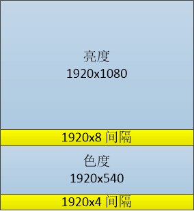

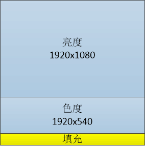
<center>图表 18 编码器输入帧内存排布</center>

上图图情况：亮度分量的宽度为1920，高度为1080，亮度数据与色度数据不直接相接，中间有8行的空行。

这种情况下，水平stride为1920，垂直stride为1088，应用需要以1920\*1088\*3/2的大小分配空间并写入数据，使用宽1920，高1080，水平stride 1920，垂直stride 1088的配置即可以正常进行编码。

下图情况：亮度分量的宽度为1920，高度为1080，亮度数据与色度数据直接相接，中间没有空行。

这种情况下，水平stride为1920，垂直stride为1080，但由于编码器对数据的访问是16对齐的，在读取亮度下边缘数据时会读取到色度部分，读取色度下边缘数据时会读取到色度数据之外的部分，需要用户开出额外的空间，这里的空间为1920\*1080\*3/2+1920\*4的填充，才能保证编码器不出现访问未分配空间的情况。

### 3.6.2 编码器控制信息输入方式以及扩展

编码器控制信息的输入方式分为两种：

一种是全局性控制信息，如码率配置，宽高配置等，作用于整个编码器和编码过程；另一种是临时性控制信息，如每帧的OSD配置信息，用户数据信息等，只作用于单帧编码过程。

第一类控制信息主要通过control接口来进行配置，第二类控制信息主要是通过MppFrame所带的MppMeta接口来进行配置。

今后对控制信息的扩展也会遵循这两种规则来进行扩展。

### 3.6.3 编码器输入输出流程

目前编码器默认输入接口仅支持阻塞式调用，输出接口支持非阻塞式和阻塞式调用，默认为非阻塞式调用，有可能出现获取数据失败的情况，需要在使用中注意。

### 3.6.4 插件式自定义码率控制策略机制

MPP支持用户自己定义码率控制策略，码率控制策略接口RcImplApi定义了几个编码处理流程上的钩子函数，用于在指定环节插入用户自定义的处理方法。具体使用方法可以参考默认的H.264/H.265码控策略实现（default_h264e/default_h265e结构）。

码控插件机制在MPP中有预留，接口与流程都不算稳定，可以预见将来还会有不少调整，只建议有能力阅读理解代码，以及持续维护更新的用户使用这个机制，一般用户不建议使用。

# 第四章 MPP demo说明

MPP的demo程序变化比较快，以下说明仅供参考，具体情况以实际运行结果为准。Demo的运行环境均以Android 32bit平台为准。

## 4.1 解码器demo

解码器demo为mpi_dec_test系列程序，包括使用decode_put_packet和decode_get_frame接口的单线程mpi_dec_test、多线程的mpi_dec_mt_test以及多实例的mpi_dec_multi_test。

以Android平台上的mpi_dec_test为例进行使用说明。直接运行测试用例mpi_dec_test，可以在日志中打印帮助文档，如下图所示：


帮助文档可以分为两部分：一是mpi_dec_test的命令参数说明；二是码流文件的协议类型说明。

命令参数的描述说明如下：

| 命令参数 | 描述说明                                        |
|----------|-------------------------------------------------|
| -i       | 输入的码流文件。                                |
| -o       | 输出的图像文件。                                |
| -w       | 图像宽度，单位为像素。                          |
| -h       | 图像高度，单位为像素。                          |
| -t       | 码流文件的协议类型。                            |
| -f       | 图像色彩空间格式以及内存排布方式，默认为NV12。  |
| -n       | 最大解码帧数。测试时若码流较长，可仅输出前n帧。 |
| -s       | MPP实例数，默认为1。                            |
| -v       | 日志选项：q为静默标志；f为fps显示标志。         |
| -slt     | 输出帧对应的校验文件。                          |
| -help    | 打开帮助文档。                                  |

mpi_dec_test的命令参数中，输入文件（i）和码流类型（t）为强制要求配置的参数，其他参数如输出文件（o）、图像宽度（w）、图像高度（h）和解码帧数（n）等为可选参数，可以根据不同的测试需求进行配置。

mpi_dec_test的命令参数中，输出帧对应的校验文件（slt）将输出帧数据转换为对应的循环冗余校验码（具体逻辑见utils/utils.c）。校验文件的大小往往只有几kB，在芯片的slt测试中，将输出帧文件的对比转换成校验文件的对比，可以显著缩短测试周期。

MPP库支持的输入文件的编码格式（t）为MPEG2/4、H.263/4/5、VP8/9和JPEG等，id后的数字为不同编码格式对应的参数值。参数值来源于OMX的定义，值得注意的是，HEVC和AVS格式的参数值与其他格式的有显著区别。

以目录/data/下的ocrean.h264解码30帧为例，对demo和输出进行说明。运行的命令为：

```bash
	mpi_dec_test -t 7 -i /data/ocrean.h264 -n 30
```

其中，-t 7表示输入码流文件的协议类型是H.264，-i表示输入文件，-n 30表示解码30帧。测试用例正常运行结果如下：


其中，打印的信息里包含了部分命令参数和部分解码日志。

MPP库的版本信息：

```
I mpp_info: mpp version: 6cc173d1 author: Ding Wei 2022-08-29 [hal_avsd]: Fix crash on avsd ref err path
```

`I mpi_dec_test: 0xeebc01c0 decode_get_frame get info changed found`

为mpi_dec_test本身的打印，表示发现解码器上报了info change事件。

`I mpi_dec_test: 0xeebc01c0 decoder require buffer w:h [1920:1080] stride [1920:1088] buf_size 4177920`

为mpi_dec_test本身的打印，表示解码器请求的图像内存情况。

`I mpi_dec_test: 0xf1c40730 decode get frame 0`

为mpi_dec_test本身的打印，表示解码器在正常解码和输出图像。

`I mpi_dec_test: decode 10 frames time 263ms delay 69ms fps 113.99`

为mpi_dec_test本身的打印，表示解码器解码30帧所用的时间为263ms，解码第一包数据的延迟时间为69ms，帧率为113.99。

`I mpi_dec_test: test success max memory 19.92 MB`

为mpi_dec_test本身的打印，表示解码器完成了解码30帧的功能，最大的内存开销为19.92 MB。

解码器的demo具体代码参见test/mpi_dec_test.c。

## 4.2 编码器demo

编码器demo为mpi_enc_test系列程序，包括单线程的mpi_enc_test及多实例的mpi_enc_multi_test。

以下以Android平台上的mpi_enc_test为例进行使用说明。直接运行测试用例mpi_enc_test，可以在日志中打印帮助文档，如下图所示：

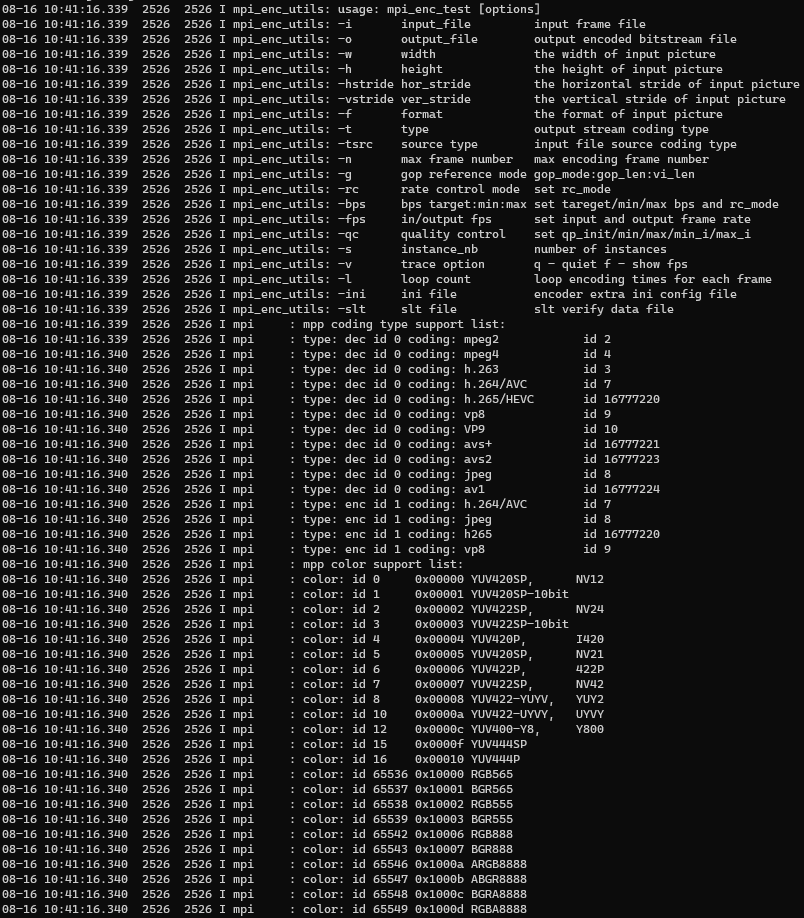

帮助文档可以分为三部分：一是mpi_enc_test的命令参数说明；二是码流文件的协议类型说明；三是图像色彩空间格式以及内存排布方式说明。

命令参数的描述说明如下：

| 命令参数                     | 描述说明                                                                                        |
|------------------------------|-------------------------------------------------------------------------------------------------|
| -i                           | 输入的图像文件。                                                                                |
| -o                           | 输出的码流文件。                                                                                |
| -w                           | 图像宽度，单位为像素。                                                                          |
| -h                           | 图像高度，单位为像素。                                                                          |
| -hstride                     | 垂直方向相邻两行之间的距离，单位为byte。                                                        |
| -vstride                     | 图像分量之间的以行数间隔数，单位为1。                                                           |
| -f | 图像色彩空间格式以及内存排布方式，默认为NV12。                                                  |
| -t | 码流文件的协议类型。                                                                            |
| -tsrc                        | 源码流格式，仅在测试整体编解码性能时使用。                                                      |
| -n                           | 最大解码帧数。测试时若码流较长，可仅输出前n帧。                                                 |
| -g                           | gop参考模式，对应不同的TSVC码流。                                                               |
| -rc                          | 码率控制模式。0:VBR; 1:CBR; 2:FIXQP; 3:AVBR。                                                   |
| -bps                         | 码率约束参数。命令格式：bps_target:bps_min:bps_max。                                            |
| -fps                         | 输入/输出帧率控制，默认为30。该命令参数仅说明输入帧率和输出帧率之间的比例关系，与实际帧率无关。 |
| -qc                          | 质量控制。                                                                                      |
| -s                           | MPP实例数，默认为1。                                                                            |
| -v                           | 日志选项：q为静默标志；f为fps显示标志。                                                         |
| -ini                         | 额外的编码配置文件ini（暂未生效）。                                                                   |
| -slt                         | 输出码流对应的校验文件。                                                                    |

mpi_enc_test的命令参数中，图像宽度（w）、图像高度（h）和码流类型（t）为强制要求配置的参数，其他参数如输入文件（i）、输出文件（o）、编码帧数（n）和色彩空间格式及内存排布方式（f）等为可选参数。如果没有指定输入文件，mpi_enc_test会生成默认的彩条图像进行编码。

mpi_enc_test的命令参数提供了多样化的码率控制方案，用户可以通过码率控制模式（rc）和码率约束参数（bps）对输出码流的码率进行控制。码率控制模式（rc）分为可变码率模式（VBR）、固定码率模式（CBR）、qp修正的码率模式（FIXQP）和自适应码率模式（AVBR），默认模式为VBR；码率约束参数（bps）则是为MPP内部配置码率边界提供参考。

mpi_enc_test的命令参数中，输入/输出帧率控制（fps）的格式为：

```bash
-fps fps_in_num:fps_in_den:fps_in_flex/fps_out_num:fps_out_den:fps_out_flex
```

其中，in/out分别表示输入/输出；num表示分子；den表示分母；flex为0表示帧率固定，为1表示帧率可变。输入和输出默认的num和den分别为30和1，即默认的输入/输出帧率为30。该命令参数仅说明输入帧率和输出帧率之间的比例关系，与实际帧率无关。

mpi_enc_test的命令参数中，质量控制（qc）仅在输出码流格式为H.264、H.265、VP8和JPEG时生效，命令格式为：

```bash
-qc qp_init/min/max/min_i/max_i
```

其中，qp表示质量参数；init表示初值；min表示最小值；max表示最大值；后缀i表示I帧最值，未标注则表示B、P帧最值。

mpi_enc_test的命令参数中，日志选项（v）为q时，MPP日常日志关闭；日志选项（v）为f时，每秒会打印一次平均帧率和当前帧率。

图像的色彩空间格式分为YUV和RGB两类。MPP支持多种内存排布方式（f），id后的数字为不同内存排布方式对应的参数值，值得注意的是，YUV和RGB格式的参数值有显著区别。

以目录/data/下的ocrean.yuv编码30帧为例，对demo和输出进行说明。运行的命令为：

```bash
mpi_enc_test -w 1920 -h 1080 -t 7 -i /data/ocrean.yuv -o /data/out.h264 -n 30
```

测试用例正常运行结果如下：


在解码器demo中已经介绍的日志略。

`I mpp_enc : MPP_ENC_SET_RC_CFG bps 7776000 [486000 : 8262000] fps [30:30] gop 60`

默认的编码器的码率控制参数，目标码率为7.8Mbps，码率参考下界为0.5Mbps，码率参考上界为8.3Mbps；默认的输入和输出帧率为30；默认gop数为60。

`I mpi_enc_test: chn 0 encoded frame 0 size 218616 qp 11`

为mpi_enc_test本身的打印，表示编码器在正常编码，输出单帧码流大小为0.2M，质量参数为11。

`I mpi_enc_test: chn 0 encode 30 frames time 628 ms delay 4 ms fps 47.72 bps 10265048`

为mpi_enc_test本身的打印，表示编码器编码30帧所用的时间为628 ms，编码第一帧数据的延迟时间为4ms，帧率为47.72，码率为10.2Mbps。

`I mpi_enc_test: mpi_enc_test average frame rate 47.72`

为mpi_enc_test本身的打印，表示编码器编码平均帧率为47.72。

编码器的控制参数还可以通过环境变量配置。在android环境下，环境变量配置命令为：

```bash
setprop <控制参数> value
```

在linux环境下，环境变量配置命令为：

```bash
export <控制参数>=value
```

相应的描述说明如下：

| 控制参数         | 类型   | 描述说明                                                                                                                                                                                                                                                                                                                       |
|------------------|--------|--------------------------------------------------------------------------------------------------------------------------------------------------------------------------------------------------------------------------------------------------------------------------------------------------------------------------------|
| constraint_set   | RK_U32 | 仅对H.264格式的码流生效，对应语法中的constraint_set0_flag至constraint_set5_flag。其中，强制标志force_flag和强制约束参数constraint_force存储格式为：\| 00 \| force_flag \| 00 \| constraint_force \|。 只有低6位生效，对应constraint_set5_flag至constraint_set0_flag，当force_flag为1时，对应的constraint_set将被配置入编码器。 |
| split_mode       | RK_U32 | 编码器分片模式。0:不分片; 1:按字节分片; 2:按CTU分片。                                                                                                                                                                                                                                                                          |
| split_arg        | RK_U32 | 分片大小参数，编码器分片模式开启后生效。按字节分片时，该参数为各片字节上限；按CTU分片时，该参数为各片CTU数上限。                                                                                                                                                                                                               |
| split_out        | RK_U32 | 分片输出模式，编码器分片模式开启后生效。1:低延时输出模式; 2:段信息输出模式。低延时输出模式下，编码器输出包内每个片的延时较低；段信息输出模式下，编码器会为每个片封装段信息。                                                                                                                                                   |
| sei_mode         | RK_U32 | SEI写入模式。0:不写入SEI; 1:序列写入模式; 2:帧写入模式。序列写入模式下，每个gop只有一个SEI；帧写入模式下，若SEI信息发生改变，则还会在每帧数据前添加SEI。                                                                                                                                                                       |
| gop_mode         | RK_U32 | gop参考模式。若环境变量gop_mode未配置，则按命令参数配置；否则，按环境变量配置。                                                                                                                                                                                                                                                |
| osd_enable       | RK_U32 | 使能OSD调色板。                                                                                                                                                                                                                                                                                                                |
| osd_mode         | RK_U32 | OSD调色板模式，使能OSD调色板后生效。0:默认配置; 1:用户定义配置。                                                                                                                                                                                                                                                               |
| roi_enable       | RK_U32 | 使能ROI测试，并根据平台配置默认的roi_type。                                                                                                                                                                                                                                                                                    |
| roi_type         | RK_U32 | 强制配置roi_type。                                                                                                                                                                                                                                                                                                             |
| user_data_enable | RK_U32 | 使能用户数据。                                                                                                                                                                                                                                                                                                                 |

编码器的demo具体代码参见test/mpi_enc_test.c。

## 4.3 实用工具

MPP提供了一些单元测试用的工具程序，这种程序可以对软硬件平台以及MPP库本身进行测试

- mpp_info_test

用于读取和打印MPP库的版本信息，在反馈问题时，可以把打印出来信息附上。

- mpp_buffer_test

用于测试内核的内存分配器是否正常。

- mpp_mem_test

用于测试C库的内存分配器是否正常。

- mpp_runtime_test

用于测试一些软硬件运行时环境是否正常。

- mpp_platform_test

用于读取和测试芯片平台信息是否正常。

# 第五章 MPP库编译与使用

## 5.1 下载源代码

MPP源代码发布官方地址：<https://github.com/rockchip-linux/mpp>

发布分支为release分支，开发分支为develop分支，默认为开发分支。

下载命令：git clone https://github.com/rockchip-linux/mpp.git

## 5.2 编译

MPP源代码编译脚本为cmake，需要依赖2.8.12以上的版本，建议使用3.x版。cmake-3.28版本验证通过。使用高版本的cmake工具可能会产生较多的warning。

### 5.2.1 Android平台交叉编译

编译Android库需要使用ndk环境，默认脚本使用android-ndk-r16b进行编译。android-ndk-r16b和android-ndk-r25c均验证通过，前者适用于android 14之前的sdk，后者适用于android 14及其之后的sdk。

以r16b ndk为例进行说明：

r16b ndk的下载路径可以在源代码目录下的build/android/ndk_links.md文件里查找。

把下载好的ndk解压到/home/pub/ndk/android-ndk-r16b，或者手动修改build/android/目录下env_setup.sh脚本的ANDROID_NDK变量路径。

进入build/android/arm/目录，运行make-Android.bash脚本生成编译用Makefile，运行make –j16进行编译。

### 5.2.2 Unix/Linux平台编译

先配置build/linux/arm/目录下arm.linux.cross.cmake文件里的工具链，再运行make-Makefiles.bash脚本通过cmake生成Makefile，最后运行make –j16进行编译。

MPP也支持直接在开发板运行的Debian上编译。

# 第六章 常见问题FAQ

Q：aarch64编译出错，报错为undefined reference to \`__system_property_get'。

A：这是google 64bit ndk的问题，其libc.so中缺少一些符号定义，问题情况参见：

<http://stackoverflow.com/questions/28413530/api-to-get-android-system-properties-is-removed-in-arm64-platforms>

解决方法：MPP中已经把对应的libc.so放到build/android/aarch64/fix/目录下，把库拷贝到path_to_ndk/platforms/android-21/arch-arm64/usr/lib/路径下，重新编译即正常。

Q：运行时会打印如下这样的内核log，是不是有问题？

vpu_service_ioctl:1844: error: unknow vpu service ioctl cmd 40086c01

A：没有问题，mpp对内核驱动有一些依赖，内核驱动有不同版本的接口，mpp会进行多次尝试。如果遇到尝试失败会进行另外一种接口的尝试。这个打印是尝试失败时打印出来的，只会打印一次，可以忽略这个打印。

Q：MPP运行异常如何分析？

A：首先先分析错误日志，如果出现打开内核设备失败的log，需要先分析内核平台的视频编解码器硬件设备配置文件是否有使能，然后提交问题到redmine上，分析运行环境问题之后，再来分析MPP运行的内部问题。
