# MPP Development Reference

| Project： | MPP         |
| --------- | ----------- |
| Version： | 0.7         |
| Author：  | Herman Chen |
| Date：    | 10/17/2023  |

| **Revision** | **Date**   | **Description**                                              | **Author**                              |
| ------------ | ---------- | ------------------------------------------------------------ | --------------------------------------- |
| 0.1          | 04/18/2018 | Initial version                                              | Herman Chen                             |
| 0.2          | 05/07/2018 | Add decoder control command description, encoder part description and demo part description | Herman Chen                             |
| 0.3          | 05/22/2018 | Fix some clerical errors and explanation errors, rearrange page numbers | Herman Chen <br/>Xiongbin Xie(精英智通) |
|              | 07/08/2019 | Translation                                                  | Lily Chen                               |
| 0.4          | 11/28/2018 | 1、Updated the memory layout instructions of the encoder input image.<br/>2、Correct the encoder flowchart error | Herman Chen<br>Vyagoo                   |
| 0.5          | 06/08/2020 | Update encoder new configuration interface, no longer supports RK3188 | Herman Chen                             |
| 0.6          | 06/11/2020 | Translation                                                  | Lily Chen                               |
| 0.7          | 10/17/2023 | add markdown document                                        | Xueman Ruan<br>Yandong Lin              |
|              |            |                                                              |                                         |
|              |            |                                                              |                                         |


# 1.1 Overview

Media Process Platform (MPP) provided by Rockchip is a general media processing software platform for Rockchip chip series. For applications the MPP platform shields the complex lower-level processing related to chips. Its purpose is to shield the differences between different chips and provide a unified media process interface (MPI) to users. The functions provided by MPP include:

-   video decoding
    -   H.265 / H.264 / H.263 / AV1 / VP9 / VP8 / AVS2 / AVS / AVS+ / MPEG-4 / MPEG-2 / MPEG-1 / VC1 / MJPEG
-   video encoding
    -   H.265 / H.264 / VP8 / MJPEG
-   video processing
    -   Video copy, zoom, color space conversion, Field video de-interleaving (Deinterlace)

 This document describes the MPP framework and its components, as well as the MPI interface for users. This document is intended for upper-level application developers and technical support staff.

# 1.2 System framework

The hierarchical diagram of MPP platform in system architecture is shown below:


<center>Figure 1 MPP system framework</center>

-   Hardware layer

 Hardware layer is the hardware accelerator module of video encoding and decoding based on Rockchip platform, including vdpu, vepu, rkvdec, rkvenc and other different type hardware accelerators with different functions.

-   Kernel driver layer

Linux kernel codec hardware driver contains device driver and related MMU, memory, clock, power management module. The supported platforms are mainly Linux kernel version 3.10, 4.4, 4.19 and 5.10. MPP libraries depend on kernel drivers.

-   MPP layer

Userspace MPP layer shields the differences between different operating systems and different chip platforms, and provides a unified MPI interface for upper users. MPP layer includes MPI module, OSAL module, HAL module, Video Decoder / Video Encoder and Video Processing module.

-   Operating system layer

 MPP userspace operating platforms, Linux distributions such as Android and Debian

-   Application layer

MPP layer can adapt to various middleware by MPI, such as OpenMax, ffmpeg and gstreamer, or directly be called by the upper application of customers.

# 1.3 Supported platform

## 1.3.1 Software platform

MPP supports running on different versions of Android platforms and pure Linux platforms.

It supports Rockchip 3.10, 4.4, 4.19 and 5.10 Linux kernels with vcodec_service device driver and corresponding DTS configuration as requirement.

## 1.3.2 Hardware platform

Support different series of Rockchip mainstream chip platforms:

RK3288 series，RK3368 series，RK3399 series，RK3588 series

RK30xx series，RK312x series，RK322x series ，RK332x series

RV1109 / RV1126 series（Note: RV1107/RV1108 will gradually not support anymore）

# 1.4 Supported function

There are a lot of great differences when MPP encoding and decoding function is running on the different chip platforms. Please refer to the Multimedia Benchmark of the corresponding chip.

# 1.5 Attentions

If you want to quickly understand MPP usage and demo please go to Chapter 4 MPP demo instruction.

If you want to compile and use MPP code quickly, please go to Chapter 5 compilation and use MPP library For detail MPP design and design principle, please refer to readme.txt in the MPP code root directory, txt documents in doc directory and annotations of header files.

# Chapter 2 Interface design instruction

This chapter describes the data structure that directly exposed to users in the process of using MPP and the usage instruction of the data structures.

Because video encoding, decoding and video processing process need to deal with a large number of data interaction, including bitstream data, image data and memory data and also deal with the cross-relationship between upper application and kernel driver MPP designed MPI interface for interaction with the upper layer. This chapter explains the data structure used in MPI interface and design principle.

## 2.1 Interface structure overview

The following figure shows the main data structures used by the MPI interface:

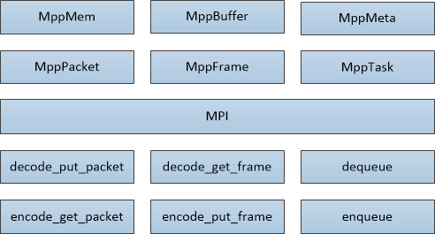
<center>Figure 2 Data structure used in MPI interface</center>

MppMem is the encapsulation of malloc memory in library C.

MppBuffer is the encapsulation of dmabuf memory for hardware.

MppPacket is a one-dimensional buffer encapsulation, which can be generated from MppMem and MapBuffer. It is mainly used to represent bitstream data.

MppFrame is a two-dimensional frame data encapsulation, which can be generated from MppMem and MapBuffer. It is mainly used to represent image data.

Using MppPacket and MapFrame the general video encoding and decoding can be accomplished simply and effectively.

Taking video decoding for example, bitstream at input side assigns the address and size to MppPacket. Input through the put_packet interface, and then get the input image MppFrame through the get_frame interface at the output side. It completes the simplest video decoding process.


<center>Figure 3 Use simple interface to realize video decoding</center>

MppMeta and MPTask are advanced combination interfaces for input and output tasks which can support complex usage modes such as specified input and output modes. It is occasionally used.

Note: The above interface data structures are all referenced using void\*handle in order to facilitate extension and forward compatibility. The members mentioned in this paragraph are accessed through interfaces such as mpp_xxx_set/get_xxx.

## 2.2 Memory structure（MppBuffer）

MppBuffer is mainly used to describe memory blocks for hardware. It provides functions such as memory block allocate and release, reference counter increase and decrease. So far ion/drm allocators are supported. Several important parameters are listed as follows:

| Parameter name | Parameter type | Description                                        |
|----------------|----------------|----------------------------------------------------|
| ptr            | void \*        | Represents virtual address of memory block.        |
| size           | size_t         | Represents size of memory block.                   |
| fd             | int            | Represents userspace file handler of memory block. |

In decoding process the decoded picture buffer usually needs to be recycled in a fixed buffer pool. To achieve this behavior MPP defines MppBufferGroup based on MppBuffer. There are two ways to use them as follows:

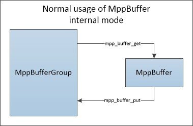
<center>Figure 4 Normal usage of MppBuffer</center>

The procedure pseudo code is shown as follows：

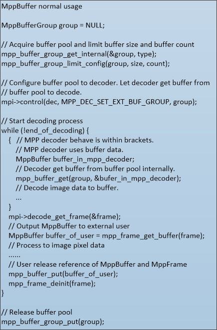

This method can implement decoder zero-copy output in decoding process (the output frame of decoder is the same as the reference frame used in decoder). But it is not easy to implement zero-copy display (the output frame of decoder may not be displayed directly on the display side). At the same time users are required to know the memory space requirement of the decoder.

Another way to use MppBufferGroup is to use it as a buffer manager only to manage external imported buffers. Its usage is shown as follows:

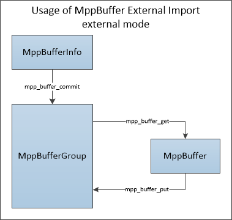
<center>Figure 5 Usage of MppBuffer External Import</center>

The procedure pseudo code is shown as follows:


This procedure can enable decoder to use external buffer, adapt to middleware such as OpenMax/ffmpeg/ gstreamer, easy to adapt to user upper application. It’s also easy to implement zero-copy display.

## 2.3 Bitstream structure（MppPacket）

MppPacket is mainly used to describe the related information of one-dimensional bitstream data, especially the location and length of valid data. Several important parameters of MppPacket are listed below:

| Parameter name | Parameter type | Description                                                                                                                                     |
|----------------|----------------|-------------------------------------------------------------------------------------------------------------------------------------------------|
| data           | void \*        | Represents start address of the buffer space.                                                                                                   |
| size           | size_t         | Represents size of the buffer space.                                                                                                            |
| pos            | void \*        | Represents start address of valid data in the buffer space.                                                                                     |
| length         | size_t         | Represents length of valid data in the buffer space. If the length changes to 0 after the decode_put_packet call the packet stream is consumed. |

Their relationship is shown below:

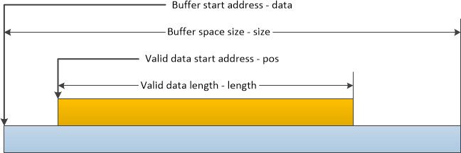
<center>Figure 6 Important parameter description of MppPacket</center>

The other configuration parameters of MppPacket are listed as follows:

| Parameter name | Parameter type | Description                                                                                                                                                                                                                                                   |
|----------------|----------------|---------------------------------------------------------------------------------------------------------------------------------------------------------------------------------------------------------------------------------------------------------------|
| pts            | RK_U64         | Represents display time stamp（Present Time Stamp）                                                                                                                                                                                                        |
| dts            | RK_U64         | Represents decoding time stamp（Decoding Time Stamp）                                                                                                                                                                                                      |
| eos            | RK_U32         | Represents end of stream flag（End Of Stream）                                                                                                                                                                                                     |
| buffer         | MppBuffer      | Represents MppBuffer associated with MppPacket                                                                                                                                                                                                        |
| flag           | RK_U32         | Represents the flag bits used within MPP, including the following flag: <br/>\#define MPP_PACKET_FLAG_EOS (0x00000001) <br/>\#define MPP_PACKET_FLAG_EXTRA_DATA (0x00000002) <br/>\#define MPP_PACKET_FLAG_INTERNAL (0x00000004) <br/>\#define MPP_PACKET_FLAG_INTRA (0x00000008) |

MppPacket, as a structure describing one-dimensional memory, needs to be initialized using allocated memory or MppBuffer memory. There are several situations when releasing MppPacket:

If the external malloc address is configured to MppPacket,the memory will not be released. As shown in the following example.

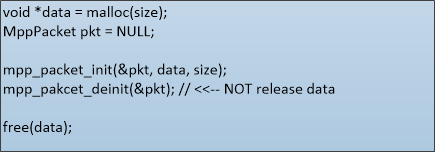

If the MppPacket is generated by copy_init, the memory allocated during the copying process will be released after the copy is completed. As shown in the following example.

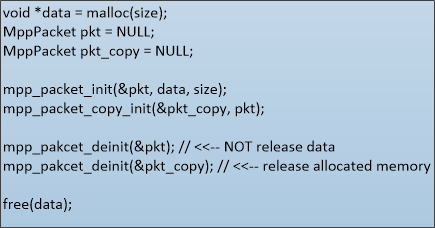

If MppPacket is generated from MppBuffer, MppBuffer is referenced at the time of MppPacket creation and dereferenced at the time of MppPacket releasing.

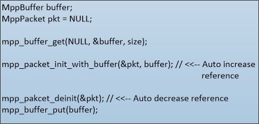

## 2.4 Image structure（MppFrame）

MppFrame is mainly used to define the related information of two-dimensional image buffer, the location and length of valid data. Several important parameters of the MppFrame are listed below:

| Parameter name | Parameter type | Description                                                                                 |
|----------------|----------------|---------------------------------------------------------------------------------------------|
| width          | RK_U32         | Represents the number of pixels in horizontal direction, in units of pixels.                |
| height         | RK_U32         | Represents the number of pixels in vertical direction, in units of pixels.                  |
| hor_stride     | RK_U32         | Represents the distance between two adjacent rows in vertical direction, in units of bytes. |
| ver_stride     | RK_U32         | Represents the number of row spacing between image components, in units of 1.               |

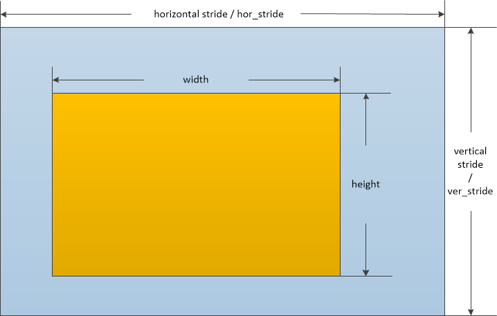
<center>Figure 7 Important parameter description of MppFrame</center>

The other configuration parameters of MppFrame are listed below:

| Parameter name | Parameter type | Description                                   |
|----------------|----------------|-----------------------------------------------|
| mode           | RK_U32         | Represents image data frame field properties:<br> |
| pts         | RK_U64              | Represents display time stamp of image（Present Time Stamp）                                                                                                                                                                                                                                                                                                                                                                    |
| dts         | RK_U64              | Represents Image decoding time stamp（Decoding Time Stamp）                                                                                                                                                                                                                                                                                                                                                                     |
| eos         | RK_U32              | Represents the end stream flag of image（End Of Stream）                                                                                                                                                                                                                                                                                                                                                                        |
| errinfo     | RK_U32              | Represents the image error flag, whether there is decoding error in the image.                                                                                                                                                                                                                                                                                                                                                    |
| discard     | RK_U32              | Represents the discarding mark of the image. If the reference relation of image decoding does not satisfy the requirement the frame image will be marked as needing to be discarded and not to be displayed.                                                                                                                                                                                                                      |
| buf_size    | size_t              | Represents the size of the buffer that the image needs to allocate, which is related to the format of the image and the format of the decoded data.                                                                                                                                                                                                                                                                               |
| info_change | RK_U32              | If true it represents that the current MppFrame is a descriptive structure for marking changes in bitstream information, indicating changes on width, height, stride or the image format. <br>Possible reasons for info_change are: <br>1. Change of image sequence width and height. <br>2. Image sequence format changes, for example 8 bit to 10 bit. <br>Once info_change is generated the memory pool used by the decoder needs to be reallocated. |
| fmt         | MppFrameFormat     | Represents image color space format and memory arrangement:  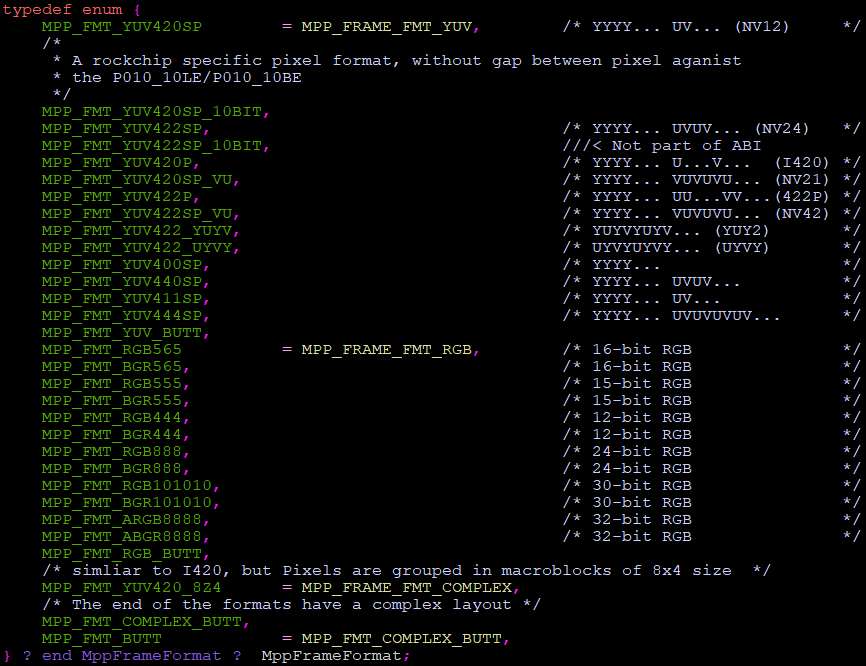                                                                                                                                                                                                                                                                                                                      |
| color_range | MppFrameColorRange | Represents the color space range of image data: <br>YUV full range：0 \~ 255（8bit） <br>YUV limit range：16 ~ 235（8bit ） <br>                                                                                                                                                                                                                                                                                                                                               |
| buffer | MppBuffer | Represents the MppBuffer corresponding to the MppFrame.                              |

For the decoder the MppFrame is its output information structure. The decoded information (including pixel data, pts, error information and other related information) of the bitstream needs to be brought to the caller within MppFrame structure. The PTS / DTS and EOS flags in the MppFrame are inherited from the corresponding input MppPacket.

Meanwhile once the resolution of input stream is changed the info_change flag in MppFrame will be set and info_change event will be notified to user who is required to modify the buffer pool.

## 2.5 Advanced task structure (MppTask)

When the interface between MppPacket and MppFrame cannot fulfill user’s requirements it is necessary to use MppTask as a data container to fulfill more complex input and output requirements. MppTask needs to be used in conjunction with poll/dequeuer/enqueue interface. Compared with simple process interfaces such as put_packet/get_frame, MppTask has complex process and low efficiency which is the cost of fulfilling complex requirements.


<center>Figure 8 Use MppTask for input and output</center>

MppTask is a structure which can be extended by keyword value (MppMetaKey) and support complex high-level requirements by extending the supported data types. Different keyword data in MppTask can be accessed using mpp_task_meta_set/get_xxx series interface.

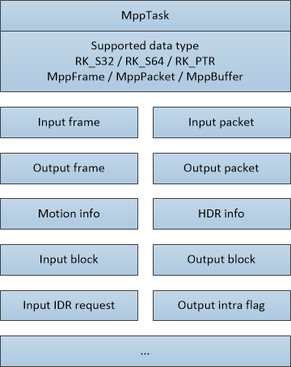
<center>Figure 9 Data Types and Keyword Types Supported by MppTask</center>

In practical usage we need to get MppTask from the input port of MPP by dequeue interface. Configure data to MppTask through mpp_task_meta_set_xxx series interface, and then enqueue to MPP instance for processing. The output port workflow of MPP is similar. But need to replace the serial interfaces of mpp_task_meta_set_xxx with the serial interfaces of mpp_task_meta_get_xxx to obtain data from MppTask.

At present the practical encoder interface and MJPEG decoding interface are implemented with MppTask.

## 2.6 Instance context structure（MppCtx）

MppCtx is the MPP instance context handle provided to user as decoder or encoder. Users can create MppCtx instance and MppApi structure by mpp_create function, initialize type of encoding or decoding and format by mpp_init function, and then access context by decode_xxx/encode_xx or poll/dequeuer/enqueue function. Finally destroy it by mpp_destroy function at the end of use.

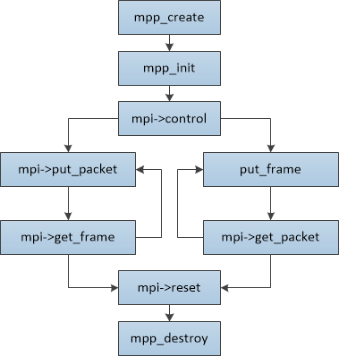
<center>Figure 10 MppCtx usage process</center>

## 2.7 API structure MppApi（MPI）

The MppApi structure encapsulates the API of MPP. User implements the video codec function by using the function pointer provided in the MppApi structure. The structure is shown below:

| Parameter name     | Parameter type   | Description                                                                                                                                                                                                                                                                                                                                                                    |
|--------------------|------------------|--------------------------------------------------------------------------------------------------------------------------------------------------------------------------------------------------------------------------------------------------------------------------------------------------------------------------------------------------------------------------------|
| size               | RK_U32           | MppApi structure size                                                                                                                                                                                                                                                                                                                                                          |
| version            | RK_U32           | MppApi structure version                                                                                                                                                                                                                                                                                                                                                       |
| decode             | Function pointer | MPP_RET (\*decode)(MppCtx ctx, MppPacket packet, MppFrame \*frame) <br>Video decoding interface, input and output at the same time, used alone. <br>ctx ：MPP instance context. <br>packet ：Input bitstream <br>frame ：output image return value ：0 is normal and non-zero is error code.                                                                                                   |
| decode_put_packet  | Function pointer | MPP_RET (\*decode_put_packet)(MppCtx ctx, MppPacket packet) <br>Video decoding input interface, used in conjunction with decode_get_frame. <br>ctx ：MPP instance context. <br>packet ：Input bitstream <br>return value ：0 is normal, indicating that the stream has been processed by MPP; non-zero is an error, and the stream has not been processed, so the stream needs to be resented. |
| decode_get_frame   | Function pointer | MPP_RET (\*decode_get_frame)(MppCtx ctx, MppFrame \*frame) <br>Video decoding output interface, used in conjunction with decode_put_packet. <br>ctx ：MPP instance context. <br>frame ：output image <br>return value ：0 is normal, indicating that the acquisition of output process is normal, we need to determine whether there is a value of the frame pointer; non-zero is error code.  |
| encode             | Function pointer | MPP_RET (\*encode)(MppCtx ctx, MppFrame frame, MppPacket \*packet) <br>Video encoding interface, input and output at the same time, used separately. <br>ctx ：MPP instance context. <br>frame ：input image <br>packet ：output bitstream <br>return value：0 is normal, non-zero is error code.                                                                                                  |
| encode_put_frame  | Function pointer | MPP_RET (\*encode_put_frame)(MppCtx ctx, MppFrame frame) <br>Video encoding input interface, used in conjunction with encode_get_packet. <br>ctx ：MPP instance context. <br>frame ：input image <br>return value ：0 is normal and non-zero is error code.                                                                                                                                    |
| encode_get_packet  | Function pointer | MPP_RET (\*encode_get_packet)(MppCtx ctx, MppPacket \*packet) Video encoding output interface, used in conjunction with encode_put_frame. <br>ctx ：MPP instance context. <br>packet ：output bitstream <br>return value ：0 is normal, non-zero is error code.|
| poll               | Function pointer | MPP_RET (\*poll)(MppCtx ctx, MppPortType type, MppPollType timeout) Port query interface, used to query whether the port has data available for dequeue. <br>ctx ：MPP instance context. <br>type ：Port types are divided into input port and output port. <br>timeout ：Query timeout parameter, -1 is blocking query, 0 is non-blocking query, and positive value is milliseconds of timeout. <br>return value ：0 is normal, data can be retrieved, non-zero is error code. |
| dequeue            | Function pointer | MPP_RET (\*dequeue)(MppCtx ctx, MppPortType type, MppTask \*task) The port dequeue interface is used to dequeue the MppTask structure from the port. <br>ctx ：MPP instance context. <br>type ：Port types are divided into input port and output port. <br>task ：MppTask<br>return value ：0 is normal, non-zero is error code.                                                                                                                                            |
| enqueue            | Function pointer | MPP_RET (\*enqueue)( MppCtx ctx, MppPortType type, MppTask task) The port enqueue interface is used to feed the port into the MppTask structure. <br>ctx ：MPP instance context. <br>type ：Port types are divided into input port and output port. <br>task ：MppTask<br>return value：0 is normal, non-zero is error code.                                                                                                                                                |
| reset              | Function pointer | MPP_RET (\*reset)(MppCtx ctx) The reset interface is used to reset the internal state of MppCtx and set to available initialized state. <br>NOTE: the reset interface is a blocked synchronous interface. <br>ctx ：MPP instance context. <br>return value ：0 is normal, non-zero is error code.                                                                                                                                                                           |
| control            | Function pointer | MPP_RET (\*control)(MppCtx ctx, MpiCmd cmd, MppParam param) Control interface, an interface for additional control operations to MPP instances. <br>ctx ：MPP instance context. <br>cmd ：Mpi command id, representing different types of control commands. <br>task ：The Mpi command parameter represents the additional parameter of the control command. <br>return value ：0 is normal, non-zero is error code.                                                            |

# Chapter 3 MPI interface instructions

This chapter describes the specific process for user to use MPI interface and some considerations on use. MPI (Media Process Interface) is the interface provided by MPP for user. It provides hardware encoding and decoding functions, as well as some necessary related functions. MPI is provided to users through function pointer in C structure. Users can use MPP context structure MppCtx and MPI interface structure MppApi to implement decoder and encoder function.


<center>Figure 11 MPI interface range range</center>

As shown in the figure above mpp_create, mpp_init and mpp_destroy are the interfaces of operating MppCtx. The mpp_create interface also obtains the MPI interface structure MppApi. The real encoding and decoding process is achieved by calling the function pointer in the MppApi structure, that is, the part in the red box in the figure above. Function calls in red boxes are divided into codec process interface put/get_packet/frame and related control and reset interfaces. The description of the codec interface is shown below, and then some key points in the work of the codec are explained.

# 3.1 Decoder data flow interface

The decoder interface provides the user with the function of input stream and output image. The interface functions are decode_put_packet function, decode_get_frame function and decode function in MppApi structure. This set of functions provides the simplest decoding support.

## 3.1.1 decode_put_packet

| Interface definition | MPP_RET decode_put_packet(MppCtx ctx, MppPacket packet)         |
|----------------------|-----------------------------------------------------------------|
| Input parameter      | ctx ：MPP Decoder instance packet ：Bit stream data to be input |
| Return parameter     | Runtime error code                                              |
| Function             | Input stream data **packet** to MPP decoder instance **ctx**.   |

##### The Form of Input Bit Stream: whole-frame and broken-frame

The input of MPP is raw stream without encapsulated information. There are two forms of raw stream input:

1. Whole frame data:
	The input data has been segmented by frame, that is, each packet of MppPacket data input to decode_put_packet function already contains one and only one complete frame. In this case, MPP can directly process the stream by package, which is the default operation of MPP.

2. Broken frame data:
	The input data is segmented by length, and then it cannot judge whether a package of MppPacket data is only one complete frame or not. MPP needs frame segmenting operation internally. MPP can also support this broken frame data. But it needs to set the need_split flag through the MPP_DEC_SET_PARSER_SPLIT_MODE command of the control interface before mpp_init.


In this way the MppPacket with broken frame data that input by decode_put_packet will be segmented frame by frame inside MPP and processed in the same way of whole frame data.

If these two situations are mixed up there will be some bitstream decoding error generated.

Whole frame data process is more efficient, but it needs to be parsed and frame segmented before input. Broken frame data process is simple to use, but its efficiency will be affected.

In the mpi_dec_test test case the default mode is broken frame mode. In Rockchip Android SDK the whole frame mode is used. Users can choose according to their application scenarios and platform conditions.

##### **Consumption of input bit stream**

The valid data length of input MppPacket is “length”. After input decode_put_packet, if the input stream is consumed successfully, the function return value is zero (MPP_OK), and the length of MppPacket is cleared to zero. If the input stream has not been processed a non-zero error code is returned, and the length of MppPacket remains unchanged.

##### **Working mode of function call**

The decode_put_packet function is to input the raw bitstream to MPP instance, but in some cases the MPP instance cannot receive more data. At this time decode_put_packet works in non-blocking mode and it will return error code directly. User gets the returned error codes and waits for a certain time, and then resends the stream data to avoid extra overhead.

##### **The number of maximum buffered packets**

By default the MPP instance can receive four input stream packets in the processing queue. If input stream is sent too fast an error code will be reported and user will be required to wait a moment and resent the stream..

## 3.1.2 decode_get_frame

| Interface definition | MPP_RET decode_get_frame(MppCtx ctx, MppFrame \*frame)                     |
|----------------------|----------------------------------------------------------------------------|
| Input parameter      | ctx ：MPP Decoder instance <br>frame ：A pointer to obtain MppFrame instances. |
| Return parameter | Runtime error code                                                                        |
| function         | Get **frame** description information of decoded frame from MPP decoder instance **ctx**. |

The image decoded by MPP is described by the structure of MppFrame. Also the structure of MppFrame is the channel for MPP decoder instance to output information. The error information of image and the info change are also output with MppFrame structure.

##### **Error information of output image**

The error information of the image is errinfo, which indicates whether there is an error in the process of decoding this image. If errInfo is not zero it means that an error occurred on decoding the corresponding bitstream. The image contains error can be discarded.

##### **Space requirement on decoding image**

When decoding image the decoder needs to obtain memory for the pixel data of output image. User is required to provide buffer with proper size to decoder. The space size requirement will be calculated in MPP decoder according to different chip platform and different video format. The calculated memory space requirement will be provided to user through the member variable buf_size of MppFrame. Users need to allocate memory according to the buf_size value to meet the requirement of decoder.

##### **Change of output image information (Info change)**

When the information such as the width, height, format, and pixel bit depth of the bitstream is changed decoder will report to user. User is required to update the memory pool used by decoder by update new memory buffer to the decoder. This involves decoding memory allocation and usage procedure, which are described in 3..2 Image Memory Allocation and Interactive Mode.

## 3.1.3 decode

The decode function is a combination of decode_put_packet and decode_get_frame data, providing user with a composite call of two functions. Its internal logic is:

1.  Try to acquire an output image;
2.  If the output image is successfully acquired, function will return;
3.  If the bitstream has been successfully sent, function will return;
4.  Send the input bitstream;
5.  Check the bitstream is sent successfully or not and loops back to step 1;

In user view, the decode function firstly try to acquire a decoded image. If the decoded image is obtained, the decoded image is preferentially returned to the caller. If there is no decoded image can be output the bitstream is sent, and then try again to get the decoded image and exit.

# 3.2 Decoder control interface

## 3.2.1 control

The MpiCmd enumeration type defined in rk_mpi_cmd.h defines the control interface command word. The decoder and decoding process commands are shown as follows:


**MPP_DEC_SET_FRAME_INFO**

The command parameter is MppFrame, which is used to configure the default width and height information of the decoder. The returned MppFrame structure will bring out the image buffer size to be allocated from the decoder. This command is called usually right after mpp_init and before decode_put_packet.

**MPP_DEC_SET_EXT_BUF_GROUP**

The command parameter is MppBufferGroup, which is used to configure the MppBufferGroup as buffer pool to decoder. This command is called at different position depending on image memory allocation mode.

**MPP_DEC_SET_INFO_CHANGE_READY**

There is no command parameter for this command. It is used to mark decoder’s MppBufferGroup has completed the reset processing of the Info change operation, and decoder can continue decoding. This command is called at different position depending on image memory allocation mode.

**MPP_DEC_SET_PRESENT_TIME_ORDER**

The command parameter is RK_U32*, which is used to process special bitstream timestamp case.

**MPP_DEC_SET_PARSER_SPLIT_MODE**

The command parameter is RK_U32*, which is used to enable the protocol parser in the MPP to process internal frame segmentation. The default bitstream input mode is whole frame mode and assume the input is frame segmented. This command is called before mpp_init.

**MPP_DEC_SET_PARSER_FAST_MODE**

The command parameter is RK_U32*, which is used to enable fast frame parsing in MPP and improve the parallelism of decoder hardware and software. However, the side-effect is some influence on error stream flag so it is disabled by default. This command is called before mpp_init.

**MPP_DEC_GET_STREAM_COUT**

The command parameter is RK_U32*. It is called by external applications to obtain the number of bitstream packets that have not been processed. It is a historical legacy interface.

**MPP_DEC_GET_VPUMEM_USED_COUT**

The command parameter is RK_U32*. It is called by external applications to obtain the number of MppBuffer used by MPP. It is a historical legacy interface.

**~~MPP_DEC_SET_VC1_EXTRA_DATA~~**

Not yet implemented. It is a historical legacy interface.

**MPP_DEC_SET_OUTPUT_FORMAT**

The command parameter is MppFrameFormat. It is called by external applications to configure the output image format of the JPEG decoder. It is not used by default.

**MPP_DEC_SET_DISABLE_ERROR**

The command parameter is RK_U32*. It is used to disable error handling of the MPP decoder. Once enabled, MPP decoding ignores the error flag of the stream, outputs all decodable images, and does not mark any errinfo in the output MppFrame structure. This command is called before decode_put_packet.

**MPP_DEC_SET_IMMEDIATE_OUT**

The command parameter is RK_U32*. It is used to enable the immediate output mode of H.264 decoder. Once enabled the H.264 decoder ignores the frame sequence discontinuity caused by frame dropping or picture order count, just outputs the current decoded image immediately. This command is called before decode_put_packet.

## 3.2.2 reset

The reset interface is used to restore the decoder to the state after normal initialization.

When the user sends the last packet of MppPacket code stream, and puts the EOS mark into the decoder, the decoder will enter the EOS state after processing the last packet of data, and will no longer receive and process the code stream. Only after resetting can it continue to receive the new code stream.

# 3.3 Key points on decoder usage

In the process of using decoder some important notices need to be paid attention to:

## 3.3.1 Decoder single/multithread usage

The MPI interface of MPP decoder is thread-safe and can be used in multi-thread environment. The single-thread mode is shown in mpi_dec_test demo, and the multi-threaded mode is shown in mpi_dec_mt_test demo.

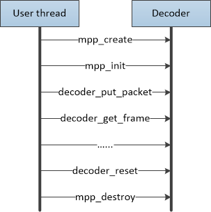

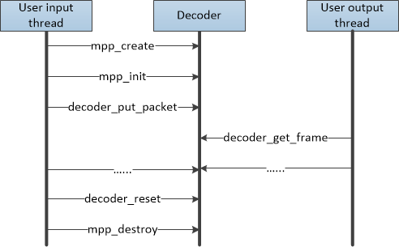

<center>Figure 12 Decoder single/multithread usage</center>

## 3.3.2 Image memory allocation and user interaction mode

When decoder decodes image it needs to obtain memory space to write pixel data. When decoding is completed, the memory space needs to be handed over to user, and released back to decoder after user completes his usage. And all the Memory space will be released when the decoder is closed. In this procedure mode zero-copy interaction can be achieved between the decoder and the user. The MPP decoder supports three memory allocation and user interaction mode:

##### **Mode 1: Pure internal allocation mode**

The image memory is allocated from the MPP decoder directly. The user obtains the decoder output image and releases it directly after use.


<center>Figure 13 Schematic diagram of pure internal allocation mode</center>

In this way the user does not need to call the MPP_DEC_SET_EXT_BUF_GROUP command of the decoder control interface, and only needs to directly call the MPP_DEC_SET_INFO_CHANGE_READY command of

the control interface when the decoder reports the info change. The decoder will automatically allocate memory internally and the user needs to release the acquired data of each frame direct I.

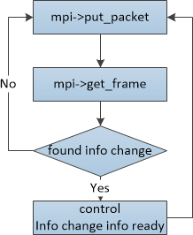
<center>Figure 14 Code flow of decoder image memory pure internal allocation mode</center>

Advantage:

Procedure is simple. A demo can be setup quickly to evaluate the decoder performance. Disadvantage：

1.  Memory is allocated internally from the decoder. If the memory has not been released when the decoder is destroyed, there may be a memory leak or crash.
2.  Unable to control the memory usage of the decoder. The decoder can use the memory without restrictions. If the bitstream is input quickly and the user does not release the decoded image memory in time, the decoder will quickly consume all available memory.
3.  To achieve zero-copy display is difficult, because the memory is allocated from the inner decoder, and the user's display system may be not compatible.

##### **Mode 2：Semi-internal allocation mode**

This mode is the default mode used by the mpi_dec_test demo. The user needs to create an MppBufferGroup according to the buf_size of the MppFrame returned by the get_frame, and configure it to the decoder through the MPP_DEC_SET_EXT_BUF_GROUP of the control interface. Users can limit the memory usage of the decoder through the mpp_buffer_group_limit_config interface.


<center>Figure 15 Semi-internal allocation mode decoder work flow</center>


Advantage：

Procedure is simple, approachable, can do some limitation on the memory usage. Disadvantage：

1.  The limitation of memory space is not accurate. The usage of memory is not fixed at 100% and will fluctuate.
2.  It is also difficult to achieve zero copy display

##### **Mode 3：Pure external allocation mode**

In this mode decoder imports the memory file handle of the external allocator (usually dmabuf/ion/drm) from the user by creating an empty external mode MppBufferGroup. On the Android platform, Mediaserver obtains the display memory from SurfaceFlinger through gralloc, commits the file handle obtained by gralloc to MppBufferGroup, configures MppBufferGroup to the decoder through the control interface MPP_DEC_SET_EXT_BUF_GROUP command, and then the MPP decoder will recycle the memory space obtained by gralloc


<center>Figure 16 Schematic diagram of pure external allocation mode</center>

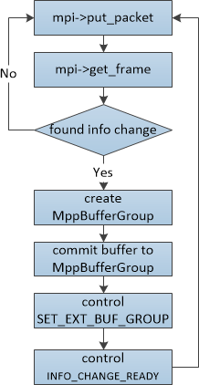
<center>Figure 17 Pure external allocation mode decoder work flow</center>

Advantage：

It is easy to achieve zero copy by directly using the memory from external display. Disadvantage:

1.  It is difficult to understand and use.
2.  The user program needs to be modified. Some user program work flow restricts the pure external allocation mode usage.

**Note on use of pure external distribution mode:**

1.  If the image memory pool is created before the decoder is created there should be an extra way to get the size of the image memory.

    General YUV420 image memory space calculation method: Image pixel datahor_stride \* ver_stride \* 3 / 2 Additional information: hor_stride \* ver_stride / 2

2.  The number of memory blocks needs to consider the requirements of both decoding and display. If the number of memory blocks is enough the decoder may get stuck.

    H.264/H.265 protocols with more reference frames require 20+ memory blocks to guarantee decoding. Other protocols require 10+ memory blocks to ensure decoding.

3.  If an info change occurs during the bitstream decoding process, the existing MppBufferGroup needs to be reset. New image memory buffer should be committed, and the external display needs to be adjusted accordingly.

# 3.4 Encoder data flow interface

The encoder interface provides the user with the image input function and bitstream output functions . The interface function is the encode_put_frame function, the encode_get_packet function and the encode function in the MppApi structure. This set of functions provides simple coding support, while the control interface provides the ability to configure the encoder.

## 3.4.1 encode_put_frame

| Interface definition | MPP_RET encode_put_frame(MppCtx ctx, MppFrame frame)                 |
|----------------------|----------------------------------------------------------------------|
| Input parameter      | ctx ：MPP decoder instance <br>frame ：Image data to be input            |
| Return parameter     | Running error code                                                   |
| Function             | Input frame image data to the MPP encoder instance specified by ctx. |

#### **Function working mode**

Since the input image of the encoder is very large in normal case, if the image copy is performed, the efficiency will be greatly reduced. Therefore, the input function of the encoder needs to wait for the encoder hardware to complete the use of the input image memory then the input function can return. The used image is returned to the caller. Based on the above considerations the encode_put_frame is a blocking function that blocks the call until the input image usage is finished. To a certain extent, the software and hardware operations cannot be paralleled and the efficiency is reduced.

#### **Copy and zero copy input**

The input of the encoder does not support the space allocated by the CPU. If you need to support the address allocated by the CPU, you need to allocate MppBuffer and copy the data into it. This will greatly affect the efficiency. The encoder prefers input memory to be in form of dmabuf/ion/drm, which enables zero-copy encoding with minimal overhead.

## 3.4.2 encode_get_packet

| Interface definition | MPP_RET encode_get_packet(MppCtx ctx, MppPacket \*packet)                                                                |
|----------------------|--------------------------------------------------------------------------------------------------------------------------|
| Input parameter      | ctx ：MPP decoder instance <br>packet ：A pointer to get an instance of MppPacket.                                           |
| Return parameter     | Runtime error mode                                                                                                       |
| Function             | The packet description information of the completed encoding is obtained from the MPP encoder instance specified by ctx. |

##### **Header information and image data**

Taking the H.264 encoder as an example, the output data of the encoder is divided into two parts: header information bitstream (sps/pps) and image data bitstream (I/P slice). The header information needs to be obtained by the MPP_ENC_GET_EXTRA_INFO command of the control interface, and the image data is obtained through the encode_get_packet interface. The timing of the header information acquisition is after the SET_RC_CFG/SET_PREP_CFG/SET_CODEC_CFG parameter configuration command of the control interface is completed. When the parameter configuration command is called, the encoder will update each parameter. After the update is completed, the latest header information can be obtained by calling MPP_ENC_GET_EXTRA_INFO

##### **H.264 encoder output stream format**

At present, the hardware fixed output stream with the start code of 00 00 00 01, so the encode_get_packet function gets the code stream with the start code of 00 00 00 01. If you need to remove the start code, you can copy it start with the address after the start code.

##### **Zero copy of code stream data**

Since there is no way to configure the output buffer when using the encode_put_frame and encode_get_packet interfaces, a copy will be made when using encode_get_packet. In general the output stream of the encoder is not large comparing to the input image, and the copy of the bitstream data is acceptable. If you need to use a zero-copy interface, you need to use the enqueue/dequeue interface and the MppTask structure.

## 3.4.3 encode

##### **Not yet implemented**

# 3.5 Encoder control interface

Encoders and decoders are different and require users to configure certain parameters. The encoder requires the user to configure the encoder configuration information through the control interface before encoding.

## 3.5.1 Control and MppEncCfg

MPP recommends using the encapsulated MppEncCfg structure to configure encoder information through the MPP_ENC_SET_CFG/MPP_ENC_GET_CFG command of the control interface.

Due to the configurable options and parameters of the encoder, the use of fixed structures is prone to frequent changes in the interface structure, resulting in the inability to ensure binary compatibility of the interface, complicated version management, and greatly increased maintenance.

To alleviate this problem, MppEncCfg uses (void \*) as the type, and uses \<string-value\> for key map configuration. The function interface is divided into s32/u32/s64/u64/ptr/st, and the corresponding interface functions are divided into set and get two groups, as follows:

```c
MPP_RET mpp_enc_cfg_set_s32(MppEncCfg cfg, const char *name, RK_S32 val);
MPP_RET mpp_enc_cfg_set_u32(MppEncCfg cfg, const char *name, RK_U32 val);
MPP_RET mpp_enc_cfg_set_s64(MppEncCfg cfg, const char *name, RK_S64 val);
MPP_RET mpp_enc_cfg_set_u64(MppEncCfg cfg, const char *name, RK_U64 val);
MPP_RET mpp_enc_cfg_set_ptr(MppEncCfg cfg, const char *name, void *val);
MPP_RET mpp_enc_cfg_set_st(MppEncCfg cfg, const char *name, void *val);

MPP_RET mpp_enc_cfg_get_s32(MppEncCfg cfg, const char *name, RK_S32 *val);
MPP_RET mpp_enc_cfg_get_u32(MppEncCfg cfg, const char *name, RK_U32 *val);
MPP_RET mpp_enc_cfg_get_s64(MppEncCfg cfg, const char *name, RK_S64 *val);
MPP_RET mpp_enc_cfg_get_u64(MppEncCfg cfg, const char *name, RK_U64 *val);
MPP_RET mpp_enc_cfg_get_ptr(MppEncCfg cfg, const char *name, void **val);
MPP_RET mpp_enc_cfg_get_st(MppEncCfg cfg, const char *name, void *val);
```

The character string is generally defined by \[type:parameter\]. The supported character strings and parameter types are as follows:

|Parameter string   |Interface   |Actual type   |Description   |
|---|---|---|---|
|rc:mode|S32|MppEncRcMode|Indicates the bit rate control mode, currently supports CBR and VBR:<br>CBR is Constant Bit Rate，fixed bit rate mode。In fixed bit rate mode, the target bit rate plays a decisive role.<br>VBR is Variable Bit Rate, variable bit rate mode.In variable bit rate mode, the maximum and minimum bit rates play a decisive role.<br>FIX_QP is a fixed QP mode, used for debugging and performance evaluation.<br>|
|rc:bps_target|S32|RK_S32|Indicates the target code rate in CBR mode.|
|rc:bps_max|S32|RK_S32|Indicates the highest bit rate in VBR mode.|
|rc:bps_min|S32|RK_S32|Indicates the lowest bit rate in VBR mode.|
|rc:fps_in_flex|S32|RK_S32|Flag bit indicating whether the input frame rate is variable. The default is 0.<br>0 means that the input frame rate is fixed, and the frame rate calculation method is fps_in_num/fps_in_denorm, which can indicate the fractional frame rate.<br>1 means that the input frame rate is variable. In the case of a variable frame rate, the frame rate is not fixed, and the corresponding code rate calculation and allocation rules become calculated according to actual time.|
|rc:fps_in_flex|S32|RK_S32|Flag bit indicating whether the input frame rate is variable. The default is 0.<br>0 means that the input frame rate is fixed, and the frame rate calculation method is fps_in_num/fps_in_denorm, which can indicate the fractional frame rate.<br>1 means that the input frame rate is variable. In the case of a variable frame rate, the frame rate is not fixed, and the corresponding code rate calculation and allocation rules become calculated according to actual time.|
|rc:fps_in_num|S32|RK_S32|Indicates the numerator part of the input frame rate score value, for example, 0 means the default 30fps.|
|rc:fps_in_denorm|S32|RK_S32|Indicates the denominator part of the input frame rate fraction value. If 0 is 1|
|rc:fps_out_flex|S32|RK_S32|Flag indicating whether the output frame rate is variable. The default is 0.<br>0 means that the output frame rate is fixed, and the frame rate calculation method is fps_out_num/fps_out_denorm, which can indicate the fractional frame rate.<br>1 means that the output frame rate is variable. In the case of variable frame rate, the frame rate is not fixed, and the corresponding code stream output time is calculated according to the actual time.|
|rc:fps_out_num|S32|RK_S32|Indicates the numerator part of the output frame rate score, such as 0 means the default 30fps.|
|rc:fps_out_denorm|S32|RK_S32|Indicates the denominator part of the output frame rate score value. If 0 is 1|
|rc:gop||RK_S32|Indicates Group Of Picture, that is, the interval between two I frames, the meaning is as follows.<br>0-indicates that there is only one I frame, other frames are P frames<br>1-means all I frames<br>2-means the sequence is I P I P I P...<br>3-means the sequence is I P P I P P I P P...<br>In general, gop is selected as an integer multiple of the input frame rate.|
|rc:max_reenc_times|U32|RK_U32|The maximum recoding times of a frame of image.|
|prep:width|S32|RK_S32|Indicates the number of pixels in the horizontal direction of the input image, in units of pixels.|
|prep:height|S32|RK_S32|Indicates the number of pixels in the vertical direction of the input image, in units of pixels.|
|prep:hor_stride|S32|RK_S32|Indicates the distance between two adjacent lines in the vertical direction of the input image, in bytes.|
|prep:ver_stride|S32|RK_S32|Indicates the number of lines between input image components, and the unit is 1.|
|prep:format|S32|MppFrameFormat|Represents the input image color space format and memory layout.<br>|
|prep:color|S32|MppFrameColorSpace|Represents the color space range of input image data.|
|prep:range|S32|MppFrameColorRange|Indicates whether the input image is full range or limit range<br>|
|prep:rotation|S32|MppEncRotationCfg|Represents the input image rotation attribute, the default is 0, no rotation.<br>|
|prep:mirroring|S32|RK_S32|Indicates the mirroring attribute of the input image, the default is no mirroring . <br>|
|codec:type|S32|MppCodingType|Indicates the protocol type corresponding to MppEncCodecCfg, which needs to be consistent with the parameters of the MppCtx initialization function mpp_init.<br>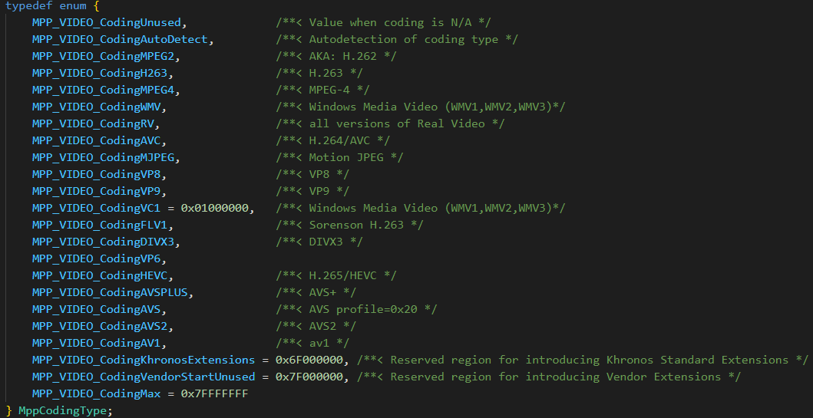|
|h264:stream_type|S32|RK_S32|Indicates the type of input H.264 stream format, and the default is 0.<br>0-indicates Annex B format, that is, the start code of 00 00 00 01 is added.<br>1-indicates a format without a start code.<br>At present, the internal fixed format is Annex B format|
|h264:profile|S32|RK_S32|The profile_idc parameter in SPS:<br>66-indicates Baseline profile.<br>77-indicates Main profile.<br>100-indicates High profile.<br>|
|h264:level|S32|RK_S32|Indicates  the level_idc parameter in SPS, where 10 represents level 1.0:10/11/12/13 – qcif@15fps / cif@7.5fps / cif@15fps / cif@30fps<br>20/21/22 – cif@30fps / half-D1@25fps / D1@12.5fps<br>30/31/32 – D1@25fps / 720p@30fps / 720p@60fps<br>40/41/42 – 1080p@30fps / 1080p@30fps / 1080p@60fps<br>50/51/52 – 4K@30fps / 4K@30fps / 4K@60fps<br>The general configuration is level 4.1 to meet the requirements.|
|h264:cabac_en|S32|RK_S32|Represents the entropy encoding format used by the encoder:<br>0 – CAVLC,Adaptive variable length coding.<br>1 – CABAC, Adaptive arithmetic coding.|
|h264:cabac_idc|S32|RK_S32|The cabac_init_idc in the protocol syntax is valid when cabac_en is 1, and the valid value is 0~2.|
|h264:trans8x8|S32|RK_S32|Indicates the 8x8 conversion enable flag in the protocol syntax.|
|h264:const_intra|S32|RK_S32|0-to close, fixed close in Baseline/Main profile.|
|h264:scaling_list|S32|RK_S32|1-to enable, selectable to enable in High profile.|
|h264:cb_qp_offset|S32|RK_S32|It indicates the constrained_intra_pred_mode mode enable flag in the protocol syntax.|
|h264:cr_qp_offset|S32|RK_S32|0-is off, 1-is on.|
|h264:dblk_disable|S32|RK_S32|Represents the scaling_list_matrix mode in the protocol syntax|
|h264:dblk_alpha|S32|RK_S32|0-flat matrix, 1-default matrix.|
|h264:dblk_beta|S32|RK_S32|Indicates the deblock_offset_beta value in the protocol syntax.|
|h264:qp_init|S32|RK_S32|The valid range is [-6, 6].|
|h264:qp_max|S32|RK_S32|Indicates the initial QP value. Do not configure it under normal circumstances.|
|h264:qp_min|S32|RK_S32|Indicates the maximum QP value, do not configure it under normal circumstances.|
|h264:qp_max_i|S32|RK_S32|Indicates the minimum QP value, do not configure it under normal circumstances.|
|h264:qp_min_i|S32|RK_S32|Indicates the maximum I frame QP value. Do not configure it under normal circumstances.|
|h264:qp_step|S32|RK_S32|Indicates the minimum I frame QP value. Do not configure it under normal circumstances.|
|h265:profile|S32|RK_S32|Indicates the frame-level QP change amplitude between two adjacent frames.|
|h265:level|S32|RK_S32|The profile_idc parameter in the VPS:|
|h265:scaling_list|S32|RK_S32|Fixed at 1, Main profile|
|h265:cb_qp_offset|S32|RK_S32|Represents the level_idc parameter in VPS|
|h265:cr_qp_offset|S32|RK_S32|Represents the scaling_list_matrix mode in the protocol syntax|
|h265:dblk_disable|S32|RK_S32|0-flat matrix, 1-default matrix.|
|h265:dblk_alpha|S32|RK_S32|Indicates the chroma_cb_qp_offset value in the protocol syntax.|
|h265:dblk_beta|S32|RK_S32|The valid range is [-12, 12].|
|h265:qp_init|S32|RK_S32|Indicates the chroma_cr_qp_offset value in the protocol syntax.|
|h265:qp_max|S32|RK_S32|The valid range is [-12, 12].|
|h265:qp_min|S32|RK_S32|Indicates the deblock_disable flag in the protocol syntax, and the valid range is [0, 2].|
|h265:qp_max_i|S32|RK_S32|0 – deblocking is enabled.|
|h265:qp_min_i|S32|RK_S32|Indicates the minimum I frame QP value. Do not configure it under normal circumstances.|
|h265:qp_step|S32|RK_S32|Indicates the frame-level QP change amplitude between two adjacent frames.|
|h265:qp_delta_ip|S32|RK_S32|Indicates the QP difference between the I frame and the previous P frame.|
|jpeg: quant|S32|RK_S32|Indicates the quantization parameter level used by the JPEG encoder. The encoder has a total of 11 levels of quantization coefficient tables, from 0 to 10, and the image quality is from poor to good.|
|split:mode|U32|MppEncSplitMode|Represents the slice split mode of H.264/H.265 protocol<br><br>0–  no split.<br>1– BY_BYTE divides the slice according to the slice size.<br>2– BY_CTU divides the slice according to the number of macroblocks or CTUs.|
|split:arg|U32|RK_U32|Slice cutting parameters:<br>In BY_BYTE mode, the parameter indicates the maximum size of each slice.<br>In BY_CTU mode, the parameter indicates the number of macroblocks or CTUs contained in each slice.|

Other strings and parameters will be expanded later.

## 3.5.2 Control other commands

The MpiCmd enumeration type defined in the rk_mpi_cmd.h file defines the control interface command word, where the commands related to the encoder and encoding process are as follows:

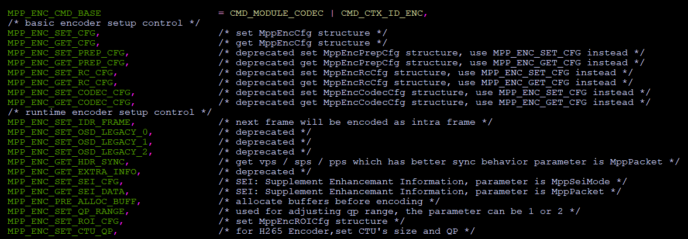

The commands from MPP_ENC_CMD_BASE to MPP_ENC_CMD_END are the control interface commands of the encoder. Among them, the MPP_ENC_SET/GET_CFG configuration command has been introduced as the basic configuration command in 3.5.1. The rest of the commands are briefly described below, where the commands are related to the encoder hardware and only some hardware support.

At present, the encoder hardware supported by MPP is divided into vepu series and rkvenc series. The vepu series supports H.264 encoding, vp8 encoding and jpeg encoding, and is equipped in most RK chips. The rkvenc series only supports H.264 encoding, and is currently only available on the RV1109/RV1126 SoC, which supports more encoding functions than the vepu series.

Brief description of some CMD commands:

**~~MPP_ENC_SET_PREP_CFG/ MPP_ENC_GET_PREP_CFG~~**
**~~MPP_ENC_SET_RC_CFG/ MPP_ENC_GET_RC_CFG~~**
**~~MPP_ENC_SET_CODEC_CFG/ MPP_ENC_GET_CODEC_CFG~~**

Deprecated commands, reserved for forward compatibility, do not use.

**MPP_ENC_SET_IDR_FRAME**

There is no command parameter. It is used to request IDR frame to the encoder. After the encoder receives the request, it encodes the next frame to be an IDR frame. All hardware supports.


**~~MPP_ENC_SET_OSD_LEGACY_0~~**
**~~MPP_ENC_SET_OSD_LEGACY_1~~**
**~~MPP_ENC_SET_OSD_LEGACY_2~~**

Deprecated commands, reserved for forward compatibility, do not use.

**MPP_ENC_GET_HDR_SYNC**/ ~~MPP_ENC_GET_EXTRA_INFO~~

The command used to obtain the stream header data separately. MPP_ENC_GET_EXTRA_INFO is an old command and is not recommended.

The input parameter of MPP_ENC_GET_HDR_SYNC is MppPacket, which requires external users to allocate space and encapsulate it as MppPacket and then control to the encoder. When the control interface returns, the data copy is completed and the thread is safe. The calling timing is after the basic configuration of the encoder is completed. The user needs to manually release the previously allocated The input parameter of MppPacket.MPP_ENC_GET_EXTRA_INFO is MppPacket*, and the internal MppPacket of the encoder will be obtained for access. The calling timing is after the basic configuration of the encoder is completed. It should be noted that the MppPacket obtained here is the internal space of the MPP and does not need to be released by the user.

In the case of multi-threading, the MppPacket obtained by the MPP_ENC_GET_EXTRA_INFO command may be modified by other controls during reading, so this command is not thread-safe and is only used for compatibility with the old vpu_api. Do not use it again.


**~~MPP_ENC_SET_SEI_CFG/MPP_ENC_GET_SEI_DATA~~**

Deprecated commands, reserved for forward compatibility, do not use.


**~~MPP_ENC_PRE_ALLOC_BUFF/MPP_ENC_SET_QP_RANGE/MPP_ENC_SET_ROI_CFG/ MPP_ENC_SET_CTU_QP~~**

Deprecated commands, reserved for forward compatibility, do not use.


**MPP_ENC_GET_RC_API_ALL**

Get the API information of the rate control strategy currently supported by MPP, enter the RcApiQueryAll* pointer, and fill in the structure content when returning.


**MPP_ENC_GET_RC_API_BY_TYPE**

Obtain the API information of all the rate control strategies of the specified MppCodingType type, enter the RcApiQueryType* pointer and specify MppCodingType, and the structure content will be filled in when returned.


**MPP_ENC_SET_RC_API_CFG**

Register the external rate control strategy API, and enter the RcImplApi* pointer. The function pointer in this structure defines the behavior of the rate control strategy plug-in. The rate control strategy after registration can be queried and activated.


**MPP_ENC_GET_RC_API_CURRENT**

Return the API information of the currently used rate control strategy, enter the RcApiBrief* pointer, and the content of the structure will be filled in when returning.


**MPP_ENC_SET_RC_API_CURRENT**

Activate the rate control strategy API of the specified name, enter the RcApiBrief* pointer, the encoder will search the rate control strategy API of the specified string name in RcApiBrief and activate it as the current rate control strategy.


**~~MPP_ENC_SET_HEADER_MODE/MPP_ENC_GET_HEADER_MODE~~**

Configure and obtain the SEI debugging information output method of the H.264/H.265 encoder. The debugging switch will be replaced by environment variables in the future. Do not use


**~~MPP_ENC_SET_SPLIT/ MPP_ENC_GET_SPLIT~~**

Configure and obtain slice split configuration information of H.264/H265 encoder, which has been replaced by split:mode and split:arg in MppEncCfg, do not use


**MPP_ENC_SET_REF_CFG**

Configure the advanced reference frame mode of the encoder. By default, no configuration is required. It is used when the long-term reference frame and short-term reference frame reference relationship modes need to be configured. It is used to configure a special reference relationship mode. It is advanced interface to be more documented.


**MPP_ENC_SET_OSD_PLT_CFG**

The command parameter is MppEncOSDPlt, which is used to configure the OSD palette of the rkvenc series hardware. Used to configure the OSD palette of rkvenc series hardware, the command parameter is MppEncOSDPlt.It is usually configured only once at the beginning of the encoding, and the full encoding process uses a uniform palette. Only the RV1109/RV1126 series supports.


**MPP_ENC_GET_OSD_PLT_CFG**

Used to obtain the OSD palette of rkvenc series hardware, the command parameter is MppEncOSDPlt*. Generally not used


**~~MPP_ENC_SET_OSD_DATA_CFG~~**

The command parameter is MppEncOSDData, which is used to configure the OSD data of the rkvenc series hardware.Used to configure OSD data of rkvenc series hardware, the command parameter is MppEncOSDData.It needs to be configured every frame, and needs to be reconfigured after each frame is encoded.This command is replaced by KEY_OSD_DATA in MppMeta with MppFrame and is no longer used.

# **3.6** **Key** points **on** **encoder** **usage**

## **3.6.1** **Width** and height of input image and stride

The width and height configuration of the input image of the encoder needs to be consistent with the arrangement of the image data in the memory. Taking the 1920x1080 size YUV420 image coding as an example, referring to the description of the important parameters of Figure 7 MppFrame, it is assumed that there are two cases as follows:

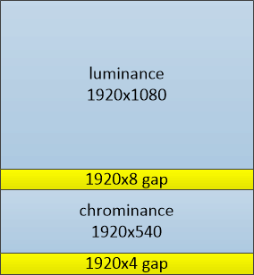

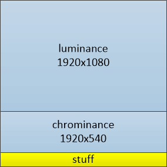

<center>Figure 18 Encoder input frame memory arrangement</center>

Left case: the width of the luminance component is 1920, the height is 1080, the luminance data and the chrominance data are not directly connected, there are 8 blank lines in the middle.

In this case, the horizontal stride is 1920 and the vertical stride is 1088. The application needs to allocate space and write data in the size of 1920\*1088\*3\/2. Use the configuration of width 1920, height 1080, horizontal stride 1920, and vertical stride 1088. That is, the encoding can be performed normally.

Right case: The width of the luminance component is 1920 and the height is 1080. The luminance data and the chrominance data are directly connected, and there is no blank line in the middle.

In this case, the horizontal stride is 1920 and the vertical stride is 1080, but because the encoder accesses the data to 16 alignment, the chroma part will be read when reading the lower edge data of the brightness, and the lower edge of the chroma will be read. The data will be read out of the chroma data, and the user needs to provide extra space. The space here is 1920\*1080\*3\/2+1920\*4 padding to ensure that the encoder does not access unallocated space.

## 3.6.2 Encoder control information input method and expansion

There are two ways to input encoder control information:

One is global control information, such as code rate configuration, width and height configuration, etc., which affects the entire encoder and encoding process; the other is temporary control information, such as OSD configuration information per frame, user data information, etc., only Acts on the single frame encoding process.

The first type of control information is mainly configured through the control interface, and the second type of control information is mainly configured through the MppMeta interface carried by the MppFrame.

Future expansion of control information will follow these two rules.

## 3.6.3 Encoder input and output process

At present, the encoder's default input interface only supports blocking calls, and the output interface supports non-blocking and blocking calls. The default is non-blocking calls. There may be a failure to obtain data. You need to pay attention to it in use.

## 3.6.4 Plug-in custom rate control strategy mechanism

MPP supports users to define their own rate control strategy. The rate control strategy interface RcImplApi defines several hook functions on the encoding processing flow, which are used to insert user-defined processing methods in designated links. For specific usage, please refer to the default H.264/H.265 code control strategy implementation (default_h264e/default_h265e structure).

The code control plug-in mechanism is reserved in the MPP, and the interface and process are not stable. It is foreseeable that there will be many adjustments in the future. It is only recommended to users who have the ability to read and understand the code and continue to maintain and update this mechanism. The general users do not Recommended for use.

# Chapter 4 MPP demo description

The demo program of MPP changes quickly. The following descriptions are for reference only. The actual operation results shall subject to practice. The operating environment of Demo is based on the Android 32bit platform.

# 4.1 Decoder demo

The decoder demo is the mpi_dec_test series programs including the single-threaded mpi_dec_test using the decode_put_packet and decode_get_frame interfaces, the multi-threaded mpi_dec_mt_test, and the multi-instance mpi_dec_multi_test.

The following is an example of using mpi_dec_test on the Android platform as an example. First run mpi_dec_test directly, help document can be printed in the log, as shown below:


The help document can be divided into two parts: command parameter descriptions of mpi_dec_test and the description of supported coding type of the input bitstream file.

The command parameter descriptions as follows.

| command parameter | descriptions                                                 |
| ----------------- | ------------------------------------------------------------ |
| -i                | input bitstream file                                         |
| -o                | output decoded frame file                                    |
| -w                | width of input bitstream, in pixels                          |
| -h                | height of input bitstream, in pixels                         |
| -t                | input bitstream coding type                                  |
| -f                | output frame format type, NV12 by default                    |
| -n                | max output frame number. If input bitstream is too long, only the first n frames can be decoded. |
| -s                | number of instances, 1 by default                            |
| -v                | trace option: q - quiet; f - show fps                        |
| -slt              | slt verify data file corresponding to output decoded frame   |
| -help             | show help                                                    |

In the command parameters of mpi_dec_test, input file (i), coding type (t) is mandatory parameter. Other parameters such as output file (o), image width (w) image height (h), decoded frame number (n), etc. are optional parameters with less effect.

In the command parameter of mpi_dec_test, slt verify data file converts the output frame data into the corresponding cyclic redundancy check code (see utils/utils.c). The size of the slt file is often only a few kB. In the slt test of the chip, the comparison of the output frame file is converted to the comparison of the slt file, which can significantly shorten the test cycle.

The following print shows the encoding format supported by the MPP library. It supports MPEG2/4, H.263/4/5, and VP8/9 decoding. The number after the id is the parameter value after the -t item corresponding to the format. The parameter values are derived from the definition of OMX. The format parameter values of HEVC and AVS are quite different from other format parameter values, so you need to pay attention.

Take 30 frames of ocrean.h264 under /data/ as an example to introduce the demo and output. The command is:

```bash
mpi_dec_test -t 7 -i /data/ocrean.h264 -n 30
```

where -t 7 indicates H.264 code stream, -i indicates input file, and -n 30 indicates decoding 30 frames. If everything is normal, the following result will be obtained:

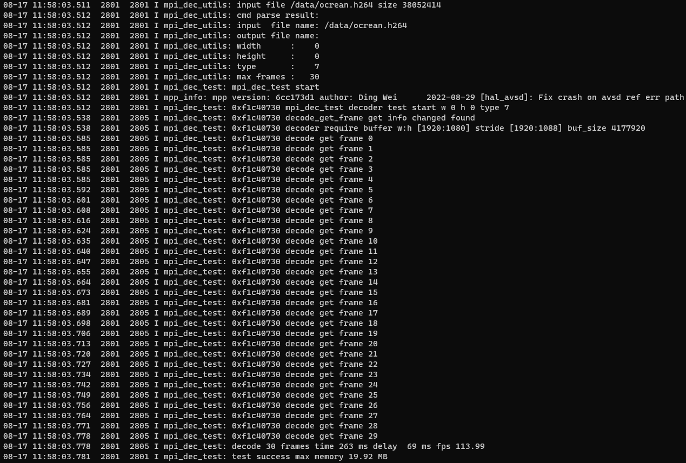

The printed information contains the version information of the MPP library:

```
I mpp_info: mpp version: 6cc173d1 author: Ding Wei 2022-08-29 [hal_avsd]: Fix crash on avsd ref err path
```

```
I mpi_dec_test: 0xeebc01c0 decode_get_frame get info changed found
```

The mpi_dec_test printing indicates that the MPP decoder has reported an info change event.

 ```
 I mpi_dec_test: 0xeebc01c0 decoder require buffer w:h [1920:1080] stride [1920:1088] buf_size 4177920
 ```

The mpi_dec_test printing indicates that the image memory condition requested by the MPP decoder.

 ```
 I mpi_dec_test: 0xf1c40730 decode get frame 0
 ```

The mpi_dec_test printing indicates that the decoder is decoding and outputting images normally.

```
I mpi_dec_test: decode 30 frames time 263ms delay 69ms  fps 113.99
```

The mpi_dec_test printing indicates that the decoder uses 263ms to decode 30 frames, first frame delays 69ms, fps is 113.99.

```
I mpi_dec_test: test success max memory 19.92 MB
```

The mpi_dec_test printing indicates that max memory of decoding is 19.92 MB.

See the test/mpi_dec_test.c for detailed decoder demo source code.

# 4.2 Encoder demo

The encoder demo is the mpi_enc_test series programs, including single-threaded mpi_enc_test and multi-instance mpi_enc_multi_test.

Take mpi_enc_test on the Android platform as an example. First run mpi_enc_test directly, output is shown below:


The help document can be divided into three parts:

(1) mpi_enc_test command parameter descriptions;

(2) the coding type description of the output encoded bitstream file;

(3) the format description of the input picture.

The command parameter descriptions as follows.

| command parameter | descriptions                                                 |
| ----------------- | ------------------------------------------------------------ |
| -i                | input frame file                                             |
| -o                | output encoded bitstream                                     |
| -w                | width of input bitstream, in pixels                          |
| -h                | height of input bitstream, in pixels                         |
| -hstride          | the horizontal stride of input picture, in byte              |
| -vstride          | the vertical stride of input picture, in 1                   |
| -f                | the format of input picture, NV12 by default                 |
| -t                | output stream coding type                                    |
| -tsrc             | input file source coding type, only used in the codec performance test(see mpi_rc2_test.c) |
| -n                | max encoding frame number. If input bitstream is too long, only the first n frames can be decoded. |
| -g                | gop reference mode                                           |
| -rc               | set rc_mode, 0:vbr 1:cbr 2:fixqp 3:avbr                      |
| -bps              | set bit rate                                                 |
| -fps              | set input and output frame rate, 30 by default. This command parameter only describes the proportional relationship between the input frame rate and the output frame rate, which is to related to the real frame rate. |
| -qc               | set quality control                                          |
| -s                | number of instances, 1 by default                            |
| -v                | trace option: q - quiet; f - show fps                        |
| -ini              | encoder extra ini config file(not yet in effect)             |
| -slt              | slt verify data file corresponding to output encoded bitstream |

mpi_enc_test command parameters, image width (w), image height (h), and coding type (t) are mandatory configuration parameters, while other parameters such as input file (i), output file (o), encoding frame number (n), and the format of input picture(f) are optional parameters. If no input file is specified, mpi_enc_test will generate a default color bar image for encoding.

mpi_enc_test command parameters provide diversified bit rate control schemes, allowing users to control the bit rate of the output stream through bit rate control mode and bit rate constraint parameter. The bit rate control mode is divided into variable bit rate mode (VBR), fixed bit rate mode (CBR), QP-adjusted bit rate mode (FIXQP), and adaptive bit rate mode (AVBR), with the default mode being VBR; the bit rate constraint parameter provides reference for configuring bit rate boundaries within MPP.

The format for input/output frame rate control (fps) in mpi_enc_test command parameters is:

 ```
 -fps fps_in_num:fps_in_den:fps_in_flex/fps_out_num:fps_out_den:fps_out_flex
 ```

where in/out represents input/output, num represents the numerator, den represents the denominator, and flex being 0 indicates fixed frame rate and 1 indicates variable frame rate. The default num and den for input and output are 30 and 1, respectively, indicating a default input/output frame rate of 30. This command parameter only indicates the proportional relationship between input frame rate and output frame rate, and is independent of the actual frame rate.

In mpi_enc_test command parameters, quality control only takes effect when the output stream format is H.264, H.265, VP8, or JPEG. The command format is:

 ```
 -qc qp_init/min/max/min_i/max_i
 ```

where qp represents quality parameters, init represents the initial value, min represents the minimum value, max represents the maximum value; the suffix i indicates the maximum value of I frames if unspecified, representing B and P frames.

In mpi_enc_test command parameters, if the logging option (v) is set to q, MPP daily logging will be disabled; if set to f, the average frame rate and current frame rate will be printed once every second.

Image color space formats are divided into YUV and RGB. MPP supports multiple formats (f), with different parameter values corresponding to different layouts; it is worth noting that there are significant differences between YUV and RGB format parameter values.

Taking encoding of ocrean.yuv under the directory /data with 30 frames as an example, the corresponding demo and output are described. The running command is:

 ```bash
 mpi_enc_test -w 1920 -h 1080 -t 7 -i /data/ocrean.yuv -o /data/out.h264 -n 30
 ```

If everything is normal, the following result will be obtained:

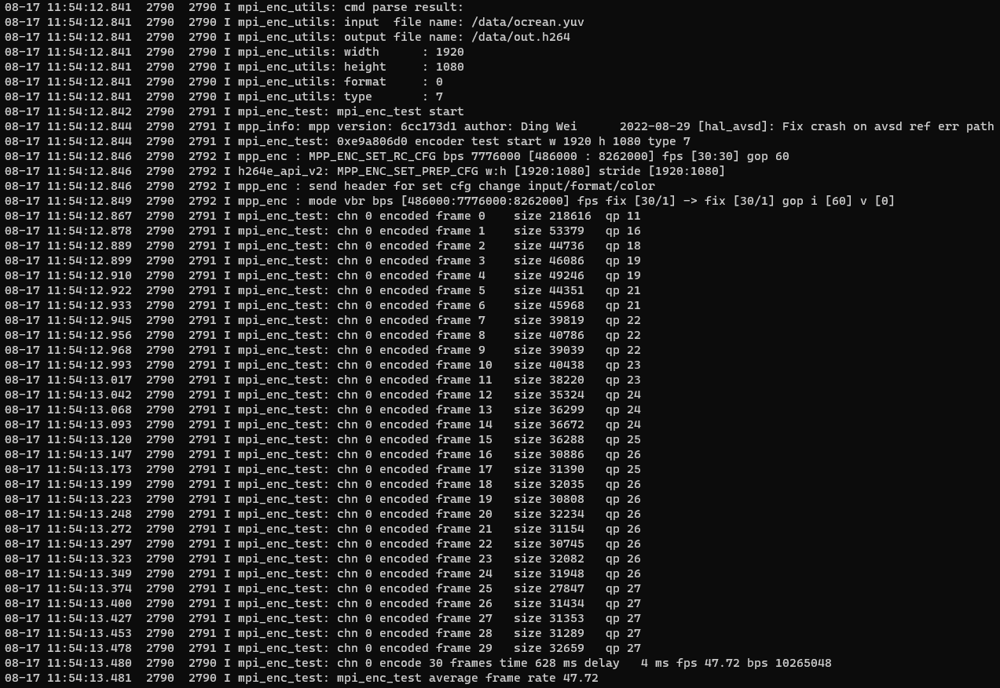

Log introduction related to the decoder demo have been omitted.

 ```
 I mpp_enc: MPP_ENC_SET_RC_CFG bps 7776000 [486000:8262000] fps [30:30] gop 60
 ```

Default bitrate control parameters for the encoder, with a target bitrate of 7.8 Mbps, a lower reference bitrate of 0.5 Mbps, and an upper reference bitrate of 8.3 Mbps. The default input and output frame rate is 30, and the default GOP size is 60.

 ```
 I mpi_enc_test: chn 0 encoded frame 0 size 218616 qp 11
 ```

The mpi_enc_test printing indicates that the encoder is encoding normally. The size of the output single-frame bitstream is 0.2 M, and the quality parameter is 11.

 ```
 I mpi_enc_test: chn 0 encode 30 frames time 628 ms delay 4 ms fps 47.72 bps 10265048
 ```

The mpi_enc_test printing indicates that the encoder encoded 30 frames within 628 ms, with a delay of 4 ms for the first frame. The frame rate is 47.72 fps, and the bitrate is 10.2 Mbps.

```
I mpi_enc_test: mpi_enc_test average frame rate 47.72
```

The mpi_enc_test printing indicates that the average frame rate of the encoder is 47.72 fps.

The encoder's control parameters can also be configured through environment variables. In the Android environment, the command for configuring environment variables is:

```bash
setprop <control parameter> value
```

In the Linux environment, the command for configuring environment variables is:

```bash
export <control parameter>=value
```

The corresponding descriptions are as follows:

| Control Parameter | Type   | Description                                                  |
| ----------------- | ------ | ------------------------------------------------------------ |
| constraint_set    | RK_U32 | Only effective for H.264 bitstream, corresponding to the constraint_set0_flag to constraint_set5_flag in the syntax. The forced flag force_flag and forced constraint parameter constraint_force are stored in the format:  \| 00 \| force_flag \| 00 \| constraint_force \| Only the lower 6 bits are valid, corresponding to constraint_set5_flag to constraint_set0_flag. When force_flag is 1, the corresponding constraint_set is configured to the encoder. |
| split_mode        | RK_U32 | Encoder split mode.  0: No split. 1: divides the slice according to the slice size. 2: divides the slice according to the number of macroblocks or CTUs. |
| split_arg         | RK_U32 | split_arg takes effect only when encoder split_mode is enabled. When by byte, this parameter is the byte limit for each slice; when by CTU, this parameter is the CTU limit for each slice. |
| split_out         | RK_U32 | Split output mode, effective only when encoder splitting mode is enabled. 1: Low delay output mode; 2:Segment information output mode. Under low delay output mode, the encoder outputs each slice with low delay; under segment information output mode, the encoder encapsulates segment information for each slice. |
| sei_mode          | RK_U32 | SEI write mode. 0: No SEI write; 1: Sequence write mode; 2: Frame write mode. Under sequence write mode, there is only one SEI for each GOP; under frame write mode, SEI will also be added before each frame if SEI information changes. |
| gop_mode          | RK_U32 | gop reference mode. If the environment variable gop_mode is not configured, it will be configured according to the command parameter; otherwise, it will be configured according to the environment variable. |
| osd_enable        | RK_U32 | Enable OSD palette.                                          |
| osd_mode          | RK_U32 | OSD palette mode, effective only after enabling OSD palette. 0: Default configuration; 1: User-defined configuration. |
| roi_enable        | RK_U32 | Enable ROI testing and use the platform's default roi_type configuration. |
| roi_type          | RK_U32 | Forced configuration of roi_type.                            |
| user_data_enable  | RK_U32 | Enable user data.                                            |

The specific code of the encoder demo can be found in test/mpi_enc_test.c, but the current encoder demo uses the enqueue/dequeue interface mode, which will be modified later.

# 4.3 Utilities

MPP provides some tool programs for unit testing, which can test the hardware and software platform and the MPP library itself.

**mpp_info_test**

Used to read and print the version information of the MPP library. When feeding back the problem, you can attach the printed information.

 **mpp_buffer_test**

Used to test whether kernel memory allocator is normal or not.

 **mpp_mem_test**

Used to test whether memory allocator of the C library is normal or not.

 **mpp_runtime_test**

Used to test whether some hardware and software running environment is normal.

 **mpp_platform_test**

Used to read and test whether the chip platform information is normal.

# Chapter 5 MPP library compiling and use

# 5.1 Download source code

The MPP source code is released at the official address: https://github.com/rockchip-linux/mpp

The release branch is the release branch, the development branch is the develop branch, and the default is the development branch.

The command of download: git clone [https://github.com/rockchip-linux/mpp.git](https://github.com/rockchip-linux/mpp.git)

# 5.2 Compiling

The MPP source code compilation script is cmake. It depends on the version above 2.8.12. It is recommended to use the 3.x version. cmake-3.28 version verification passed. Using the high version of the cmake tool may generate more warnings.

## 5.2.1 Android platform cross-compiling

Compiling the Android library requires the ndk environment, and the default script is compiled using android-ndk-r16b. Both android-ndk-r16b and android-ndk-r25c are verified. The former applies to sdks below android 14, and the latter applies to sdks above android 14.

Take the r16b ndk for example:

The download path for r16b ndk can be found in the build/android/ndk_links.md file in the source directory.

Unzip the downloaded ndk to /home/pub/ndk/android-ndk-r16b, or manually modify the ANDROID_NDK variable path of the env_setup.sh script in the build/android/ directory.

Go to the build/android/arm/ directory, run the make-Android.bash script to generate the Makefile for compilation, and run make –j16 to compile.

## 5.2.2 Unix/Linux platform compiling

First configure the toolchain in the arm.linux.cross.cmake file in the build/linux/arm/ directory, then run the make-Makefiles.bash script to generate the Makefile via cmake, and finally run make –j16 to compile.

MPP also supports compiling directly on Debian running on the development board.

# Chapter 6 Frequently Asked Questions

Q: Aarch64 compile error, the error is undefined reference to \`system_property_get\`.

A: This is a problem with google 64bit ndk. Some symbol definitions are missing from libc.so. For the problem, see:

[http://stackoverflow.com/questions/28413530/api-to-get-android-system-properties-is-removed-in-arm6](http://stackoverflow.com/questions/28413530/api-to-get-android-system-properties-is-removed-in-arm64-platforms) [4-platforms](http://stackoverflow.com/questions/28413530/api-to-get-android-system-properties-is-removed-in-arm64-platforms)

Solution: MPP has put the corresponding libc.so into the build/android/aarch64/fix/ directory, copy the library to the path_to_ndk/platforms/android-21/arch-arm64/usr/lib/ path. You just need recompiling.

Q: When running, the following kernel log will be printed, is there a problem?？

vpu_service_ioctl:1844: error: unknow vpu service ioctl cmd 40086c01

A: No problem, mpp has some dependencies on the kernel driver, the kernel driver has different versions of the interface, mpp will make multiple attempts. If it fails, it will try another interface. This print is printed when the attempt fails and will only be printed once. This print can be ignored.

Q: How to analyze the problem of abnormal MPP operation？

A: First analyze the error log. If there is a log that fails to open the kernel device, you need to analyze whether the hardware device configuration file of the video codec of the kernel platform is available, and then submit the problem to redmine. After analyzing the operating environment problem, analyze the MPP operation Internal issue.