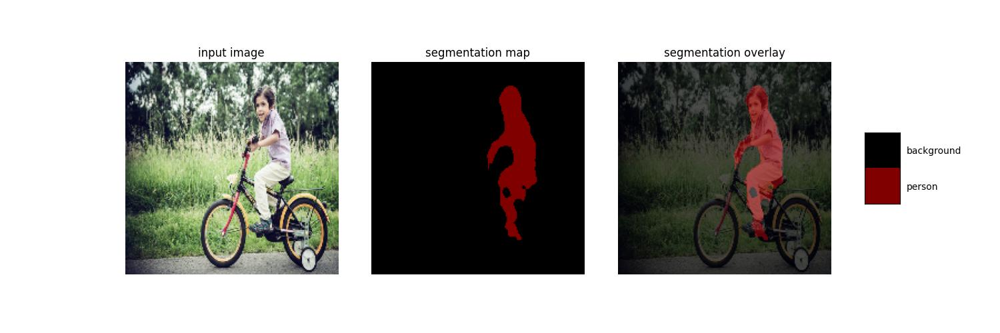

# How to use custom OP function

## Model Source

The example demo is from PaddleSeg under the project of PaddlePaddle. The specfication can be seen with the following link: [link_PP-HumanSeg](https://github.com/PaddlePaddle/PaddleSeg/tree/release/2.9/contrib/PP-HumanSeg)  

The example model is the PP-HumanSegV2-Mobile, which can be downloaded with this link: [link_PP-HumanSegV2-Mobile](https://paddleseg.bj.bcebos.com/dygraph/pp_humanseg_v2/human_pp_humansegv1_mobile_192x192_inference_model.zip).

Note: Referring to Paddle2onnx for converting paddle model to onnx model.

## Script Usage
*Usage:*

```
python test.py
```
*Description:*

- The default target platform in script is 'RK3588', please modify the 'target_platform' parameter of 'rknn.config()' according to the actual platform.

## Processes
The process of this example is as follows:
1. Init RKNN.
2. Register custom OP ArgMax.
3. Convert ONNX model to RKNN model.
4. Infer RKNN model in simulator.
5. Save the picture of results.
6. Release RKNN resource.

## Expected Results
1. Got a rknn model with registered ArgMax op.
3. Get a picture of mask and composed image results named result.jpg.


- Note: Different platforms, different versions of tools and drivers may have slightly different results.
